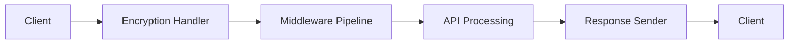
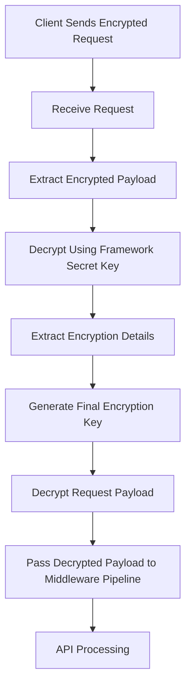
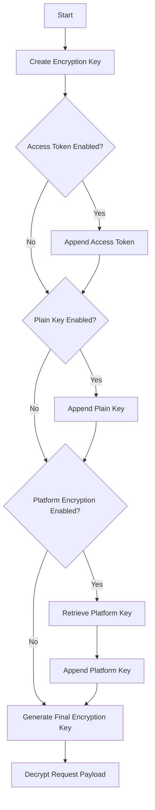
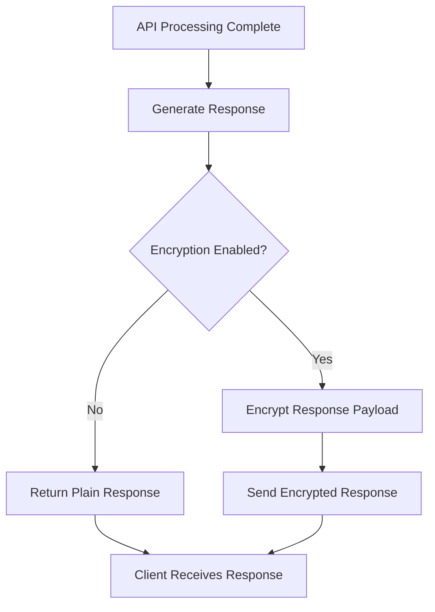
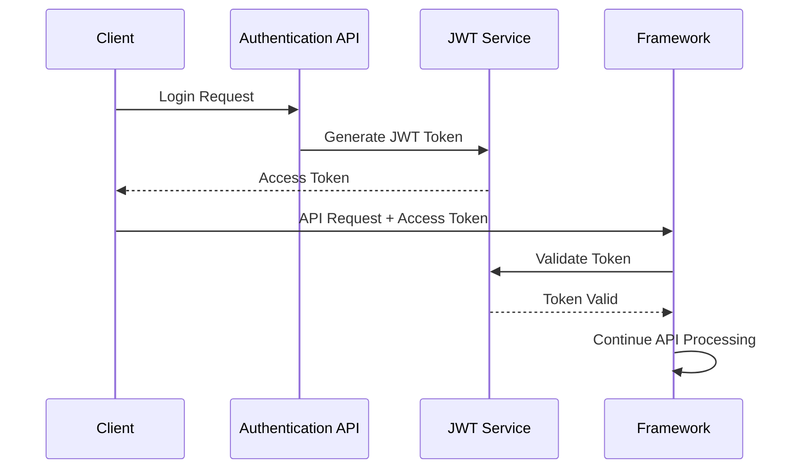
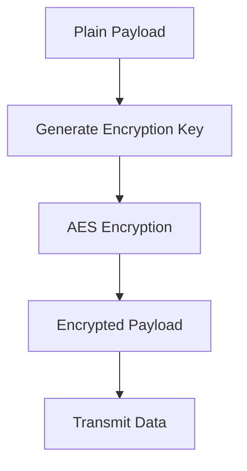
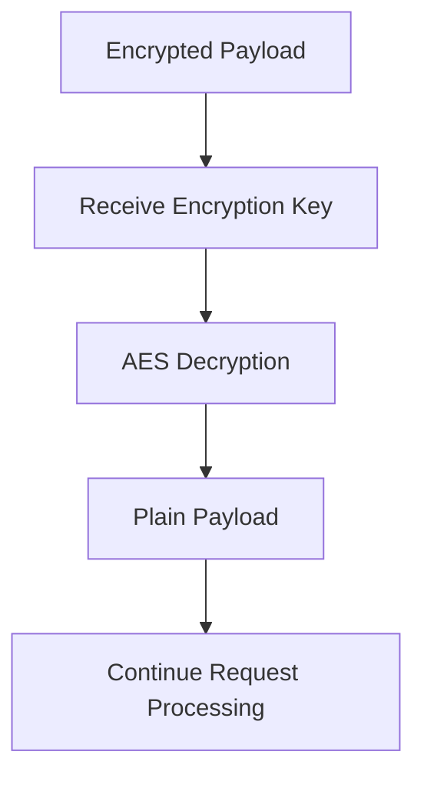

# ENCRYPTION & DECRYPTION FLOW

## 1. Introduction

The purpose of this document is to explain how encryption and decryption are implemented within the CSAAS server framework.

The framework secures communication by encrypting request and response data using configurable encryption settings. Instead of applying encryption globally, each API independently defines its own communication requirements through its API Object configuration. This allows different APIs to enable or disable encryption based on their functional requirements.

During request processing, encrypted payloads are decrypted before entering the middleware pipeline. Similarly, responses are encrypted before being returned to the client. The framework also supports JWT-based authentication and platform-specific encryption, allowing multiple encryption mechanisms to work together within the request lifecycle.

This document focuses on the encryption architecture, request and response flow, encryption key generation, and the interaction between encryption and authentication.

---

# 2. Learning Objectives

After studying this document, developers should be able to:

- Understand the framework's encryption architecture.
- Understand how encryption is configured within API Objects.
- Explain the request decryption workflow.
- Understand how encryption keys are generated.
- Explain the response encryption process.
- Differentiate between AES encryption and JWT authentication.
- Identify the important code locations responsible for encryption.
- Debug common encryption-related issues.

---

# 3. Important Code Locations

The following locations contain the primary components responsible for encryption and decryption within the framework.

| Code Location                                              | Purpose                                                                         |
| ---------------------------------------------------------- | ------------------------------------------------------------------------------- |
| `Services/SysFunctions/Encryption/aes.js`                  | Provides AES encryption and decryption utilities used throughout the framework. |
| `Services/SysFunctions/Encryption/jwt_encryption.js`       | Generates JWT access tokens for authenticated communication.                    |
| `Services/SysFunctions/Encryption/jwt_decryption.js`       | Validates and decodes JWT access tokens.                                        |
| `Services/SysFunctions/Decryption.js`                      | Performs recursive decryption of encrypted request payloads.                    |
| `Services/Middlewares/PlatformCheck/platformEncryption.js` | Generates the final encryption key and decrypts incoming request payloads.      |
| `Src/Config/Security/config.js`                            | Integrates encryption and decryption into the request processing pipeline.      |
| `Services/Middlewares/TokenValidation/validateToken.js`    | Validates access tokens before protected APIs are executed.                     |
| `Src/Apis/`                                                | Contains API Objects that define API-specific encryption requirements.          |

Only the purpose of each location is introduced in this document. The implementation details are explained in the following sections.

---

# 4. Encryption Overview

Encryption within the framework is **API-driven** rather than globally enforced.

Each API Object specifies whether encryption should be applied through its communication configuration. This allows different APIs to define different security requirements without modifying the framework itself.

The framework supports multiple encryption components that work together to secure request and response communication.

These include:

- Platform-specific encryption keys
- Access-token-based key generation
- Plain key encryption
- AES payload encryption
- JWT-based authentication

During request processing, the framework decrypts incoming request data before executing middleware and business logic. Once processing completes, the response is encrypted before being returned to the client.

---

## Encryption Architecture

The following diagram provides a high-level overview of how encrypted requests are processed within the framework.



---

# 5. API Encryption Configuration

Encryption is controlled through the **communication** section of each API Object.

### Example

The following API Object enables both platform-specific encryption and access-token-based encryption.

```javascript
communication: {
    encryption: {
        platformEncryption: true,
        accessToken: true
    }
}
```

This configuration is used by the framework to determine how the final encryption key should be generated.

An API can also disable encryption completely.

```javascript
communication: {
  encryption: false;
}
```

The available configuration options are described below.

| Configuration        | Purpose                                                                                 |
| -------------------- | --------------------------------------------------------------------------------------- |
| `platformEncryption` | Includes the platform-specific encryption key when generating the final encryption key. |
| `accessToken`        | Includes the authenticated user's access token during encryption key generation.        |
| `plainKey`           | Adds a predefined encryption key configured for the API.                                |
| `encryption: false`  | Disables request and response encryption for the API.                                   |

This design allows every API to define its own encryption requirements without changing the framework implementation.

---

# 6. Request Encryption Flow

Before an API is executed, the framework determines whether request encryption is enabled for the current API. If encryption is configured, the encrypted payload is decrypted before entering the middleware pipeline.

The decryption process is handled by the platform encryption middleware, which extracts the encrypted request, generates the required encryption key, decrypts the payload, and passes the decrypted data to the remaining request processing pipeline.

## Request Encryption Flow



The request processing sequence consists of the following stages.

| Step                               | Description                                                                                 |
| ---------------------------------- | ------------------------------------------------------------------------------------------- |
| Receive Request                    | The framework receives the incoming HTTP request.                                           |
| Extract Encrypted Payload          | The encrypted payload is extracted from the request header or request body.                 |
| Decrypt Using Framework Secret Key | The framework decrypts the outer encrypted request using the framework secret key.          |
| Extract Encryption Details         | Encryption metadata such as the access token and platform information is extracted.         |
| Generate Final Encryption Key      | The framework builds the encryption key according to the API configuration.                 |
| Decrypt Request Payload            | The actual request payload is decrypted using the generated encryption key.                 |
| Continue Processing                | The decrypted payload enters the middleware pipeline and API processing continues normally. |

---

# 7. Encryption Key Generation

The framework dynamically generates an encryption key during every request. The final key depends on the encryption configuration defined inside the API Object.

Rather than using a single static key, multiple components can be combined to construct the final encryption key.

The framework builds the encryption key dynamically according to the communication configuration defined by the current API Object.

Depending on the configuration, the final key may consist of one or more components, including the authenticated user's access token, a predefined plain key, and a platform-specific encryption key retrieved from the database.

Possible components include:

- Access Token
- Platform Encryption Key
- Plain Encryption Key

Only the components enabled in the API configuration are included.

## Encryption Key Generation Flow



The final encryption key may contain one or more of the following values depending on the API configuration.

| Component    | Purpose                                                            |
| ------------ | ------------------------------------------------------------------ |
| Access Token | Uses the authenticated user's token as part of the encryption key. |
| Plain Key    | Uses a predefined encryption key configured for the API.           |
| Platform Key | Retrieves the platform-specific encryption key from the database.  |

This dynamic approach allows each API to implement different encryption requirements without changing the framework implementation.

---

# 8. Response Encryption Flow

After the API completes processing, the framework prepares the response before sending it back to the client.

If encryption is enabled for the API, the response payload is encrypted using the same encryption key that was generated during request processing.

## Response Encryption Flow



The response process consists of the following stages.

| Step                           | Description                                                                                                                                                                   |
| ------------------------------ | ----------------------------------------------------------------------------------------------------------------------------------------------------------------------------- |
| Generate Response              | The API finishes processing and prepares the response object.                                                                                                                 |
| Check Encryption Configuration | The framework checks the current API Object's `communication.encryption` configuration to determine whether the response should be encrypted before being sent to the client. |
| Encrypt Response               | If enabled, the response payload is encrypted using the generated encryption key.                                                                                             |
| Send Response                  | The encrypted or plain response is returned to the client.                                                                                                                    |

Using the same encryption key for both request decryption and response encryption ensures secure communication throughout the complete request lifecycle.

---

# 9. JWT Authentication Flow

The framework uses JSON Web Tokens (JWT) to authenticate users before protected APIs are executed.

After a successful login, a JWT access token is generated and returned to the client. For subsequent requests, the client includes this token in the request. Before the API is executed, the framework validates the token to verify the user's identity and ensure that the token has not expired.

JWT authentication is independent of AES encryption. However, if the API configuration enables **accessToken** encryption, the validated JWT token is also incorporated into the final encryption key.

## JWT Authentication Flow



The JWT authentication process consists of the following stages.

| Step                | Description                                                   |
| ------------------- | ------------------------------------------------------------- |
| User Login          | The client submits valid authentication credentials.          |
| Token Generation    | The framework generates a JWT access token.                   |
| API Request         | The client sends the access token with future API requests.   |
| Token Validation    | The framework verifies the token before executing the API.    |
| Continue Processing | If the token is valid, request processing continues normally. |

---

# 10. AES Encryption and Decryption

The framework uses AES encryption to secure request and response payloads. AES is responsible for protecting the confidentiality of application data during transmission.

The framework encrypts request and response payloads using AES with the dynamically generated encryption key. During request processing, encrypted data is decrypted before entering the middleware pipeline, while response data is encrypted before being returned to the client.

Unlike JWT, which authenticates users, AES is responsible for protecting application data during transmission.

The AES utility performs both encryption and decryption operations using the generated encryption key.

## AES Encryption Flow



## AES Decryption Flow



### JWT vs AES

| JWT                                    | AES                                                  |
| -------------------------------------- | ---------------------------------------------------- |
| Used for authentication.               | Used for encrypting application data.                |
| Generates and validates access tokens. | Encrypts and decrypts request and response payloads. |
| Verifies user identity.                | Protects sensitive data during communication.        |

Both mechanisms work together to provide secure communication throughout the framework.

---

# 11. Common Encryption Errors and Debugging

The following table lists common encryption-related issues and recommended debugging steps.

| Error                            | Possible Cause                                         | Recommended Debugging                                         |
| -------------------------------- | ------------------------------------------------------ | ------------------------------------------------------------- |
| Missing encrypted payload        | Request payload not provided or not encrypted.         | Verify that the client sends the encrypted request correctly. |
| Invalid access token             | Missing, invalid, or expired JWT token.                | Verify token generation and validation.                       |
| Platform key not found           | Invalid platform name or version.                      | Verify the platform configuration stored in the database.     |
| Invalid encryption configuration | Incorrect API communication configuration.             | Review the API Object communication settings.                 |
| Decryption failure               | Incorrect encryption key or corrupted payload.         | Verify the generated encryption key and encrypted payload.    |
| Response encryption failure      | Encryption process failed before sending the response. | Verify encryption configuration and framework logs.           |

---

# 12. Related Documentation

Encryption is one part of the complete request lifecycle.

The following documents describe the remaining framework components.

| Document                               | Description                                                            |
| -------------------------------------- | ---------------------------------------------------------------------- |
| Server Startup + Bootstrap             | Explains how the framework initializes during startup.                 |
| Middleware Pipeline and API Processing | Explains how requests are processed after decryption.                  |
| API Creation Process                   | Describes how API Objects are created and configured.                  |
| executeQueryWithPagination             | Explains pagination, filtering, sorting, and query execution features. |

---

# Conclusion

The CSAAS framework implements a configurable encryption architecture that allows each API to define its own communication requirements.

Rather than relying on a single encryption mechanism, the framework combines API configuration, platform-specific encryption, AES encryption, and JWT authentication to secure request and response communication.

By integrating encryption directly into the middleware pipeline, the framework ensures that sensitive data remains protected throughout the complete request lifecycle while allowing individual APIs to customize their own security requirements.

This modular approach improves flexibility, maintainability, and consistency across the framework while supporting secure communication between clients and the server.
