# EXECUTE QUERY WITH PAGINATION

## 1. Introduction

The purpose of this document is to explain how the `executeQueryWithPagination()` component processes database queries within the CSAAS framework.

The framework provides a reusable query execution mechanism that automatically supports pagination, filtering, sorting, searching, and column mapping without requiring individual APIs to implement these features manually.

Instead of writing custom pagination logic for every API, developers can enable pagination through the API Object configuration. Once enabled, the Query Resolver automatically invokes `executeQueryWithPagination()` during request processing.

This document explains the architecture, execution flow, supported features, database interaction, and request lifecycle of the pagination engine.

---

# 2. Learning Objectives

After studying this document, developers should be able to:

- Understand the purpose of `executeQueryWithPagination()`.
- Explain how pagination is enabled within an API Object.
- Understand the complete query execution flow.
- Understand filtering, sorting, and searching.
- Explain how SQL queries are dynamically constructed.
- Understand how Query Resolver integrates with pagination.
- Identify the important code locations responsible for query execution.
- Debug common pagination and query execution issues.

---

# 3. Important Code Locations

The following locations contain the primary components responsible for paginated query execution.

| Code Location                                                  | Purpose                                                                                             |
| -------------------------------------------------------------- | --------------------------------------------------------------------------------------------------- |
| `Services/Integrations/Database/executeQueryWithPagination.js` | Implements pagination, filtering, sorting, searching, and SQL query generation.                     |
| `Services/Integrations/Database/queryExecution.js`             | Executes the final SQL query against the database.                                                  |
| `Services/Integrations/Database/requestConnection.js`          | Creates and manages database connections before query execution.                                    |
| `Services/Middlewares/QueryResolver/queryResolver.js`          | Determines whether pagination should be applied and invokes the appropriate query execution method. |
| `Src/Apis/`                                                    | Defines API-specific pagination settings through the API Object configuration.                      |

Only the purpose of each location is introduced here. The implementation details are explained in the following sections.

---

# 4. Overview

`executeQueryWithPagination()` is the framework's reusable database query execution component.

It extends normal query execution by providing several built-in features including:

- Pagination
- Filtering
- Sorting
- Searching
- Column Mapping
- Dynamic SQL Query Generation

Rather than implementing these features separately in every API, developers only need to enable pagination within the API Object configuration. The framework automatically performs the remaining operations during request processing.

This approach improves consistency, reduces duplicate code, and simplifies API development.

The Query Resolver automatically determines whether this component should be used based on the current API Object configuration.

---

# 5. Features Provided by executeQueryWithPagination()

The pagination engine provides several built-in capabilities.

| Feature                         | Description                                                                                                                                   |
| ------------------------------- | --------------------------------------------------------------------------------------------------------------------------------------------- |
| Pagination                      | Returns results page by page using page number and page size.                                                                                 |
| Filtering                       | Filters records according to values provided in the request.                                                                                  |
| Sorting                         | Sorts query results in ascending or descending order.                                                                                         |
| Searching                       | Performs keyword-based searching across configured columns.                                                                                   |
| Column Mapping                  | Column Mapping allows clients to use simple API field names while the framework automatically maps them to the correct database column names. |
| Dynamic SQL Generation          | Builds SQL queries automatically based on request parameters.                                                                                 |
| Alias Detection                 | Identifies table aliases to generate valid SQL queries when joins are used.                                                                   |
| AND / OR Filtering              | Supports combining multiple filter conditions using AND and OR operators.                                                                     |
| Dynamic WHERE Clause Generation | Automatically generates WHERE conditions based on the supplied filters.                                                                       |
| Total Record Count              | Calculates the total number of matching records for pagination metadata.                                                                      |
| Query Preview                   | Generates the final SQL query for debugging and development purposes.                                                                         |

These features work together to provide flexible and reusable query execution across different APIs.

---

# 6. Enabling Pagination

Pagination is controlled through the API Object configuration.

When the pagination feature is enabled, the Query Resolver automatically executes `executeQueryWithPagination()` instead of the standard query execution method.

## Example

The following API Object enables pagination for the current endpoint.

```javascript
config: {
  features: {
    pagination: true,
  }
}
```

When this configuration is enabled, the framework automatically performs pagination during query execution.

If pagination is disabled, the framework executes the query normally without applying pagination.

---

# 7. High-Level Architecture

The following diagram illustrates how pagination integrates with the request processing pipeline.

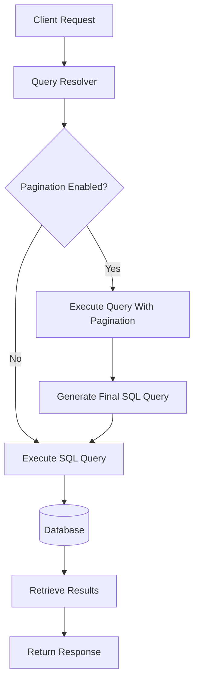

The Query Resolver determines whether pagination is enabled for the current API. If enabled, the request is processed through `executeQueryWithPagination()`. Otherwise, the framework executes the query using the standard query execution mechanism.

---

# 8. Query Processing Flow

The `executeQueryWithPagination()` function extends normal query execution by dynamically modifying the SQL query according to the request parameters.

Instead of executing the original SQL query directly, the framework analyzes the incoming request, applies pagination, filtering, sorting, and searching, and then executes the final SQL query against the database.

## Query Processing Flow

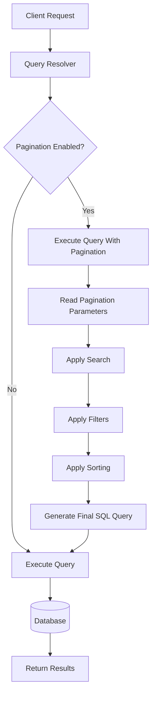

The query execution process consists of the following stages.

| Step                       | Description                                                              |
| -------------------------- | ------------------------------------------------------------------------ |
| Read Pagination Parameters | Reads the page number and page size from the request.                    |
| Apply Search               | Applies keyword-based searching if search parameters are provided.       |
| Apply Filters              | Adds filtering conditions to the SQL query.                              |
| Apply Sorting              | Sorts the query results according to the requested column and direction. |
| Generate Final SQL Query   | Combines all query modifications into the final SQL statement.           |
| Execute Query              | Executes the generated SQL query against the database.                   |
| Return Results             | Returns the paginated results to the Query Resolver.                     |

---

# 9. Pagination

Pagination allows large datasets to be divided into smaller pages instead of returning all records at once.

The framework automatically calculates which records should be returned based on the current page number and the number of records requested per page.

This improves performance, reduces network traffic, and provides a better user experience when working with large datasets.

## Pagination Flow

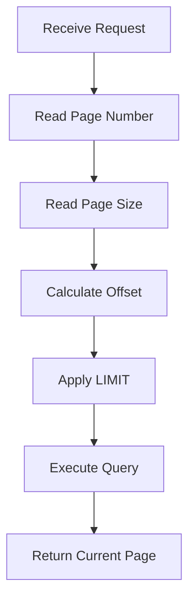

### Pagination Parameters

| Parameter | Purpose                                                       |
| --------- | ------------------------------------------------------------- |
| Page      | Specifies which page of data should be returned.              |
| Limit     | Specifies the maximum number of records returned per page.    |
| Offset    | Determines where the database should begin returning records. |

The framework calculates the appropriate `LIMIT` and `OFFSET` values based on the requested page number and page size. These values are appended to the final SQL query to retrieve only the required records from the database.

---

# 10. Filtering

Filtering allows the client to retrieve only the records that satisfy specific conditions.

Rather than returning every record from the database, the framework dynamically appends filtering conditions to the SQL query according to the request parameters.

If no filters are provided, the original query is executed without modification.

## Filtering Flow

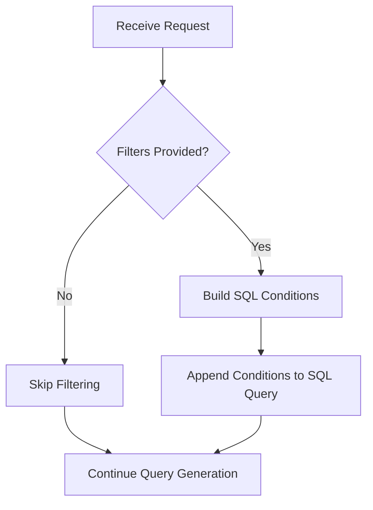

Filtering allows APIs to return only the information required by the client while reducing unnecessary database processing.

---

# 11. Sorting

Sorting determines the order in which database records are returned.

The framework automatically applies sorting when a valid sort column and sort direction are supplied in the request.

If no sorting information is provided, the original query order is preserved.

## Sorting Flow

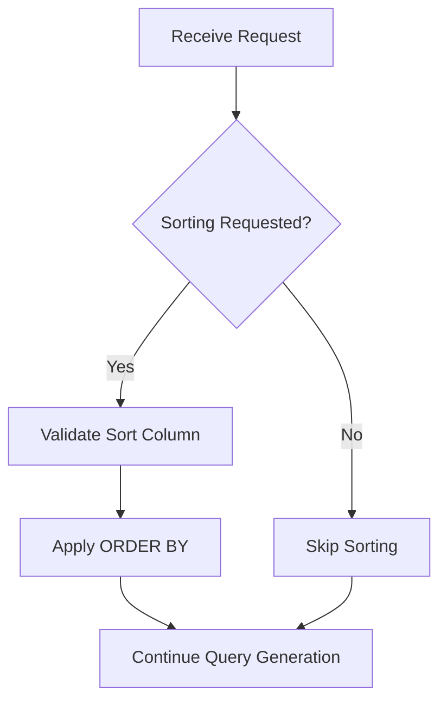

The framework supports both ascending and descending sorting.

---

# 12. Searching

Searching allows clients to locate records by providing a keyword rather than exact filter values.

When a search value is supplied, the framework generates search conditions across the configured searchable columns and appends them to the SQL query.

If no search keyword is provided, the search step is skipped.

## Search Flow

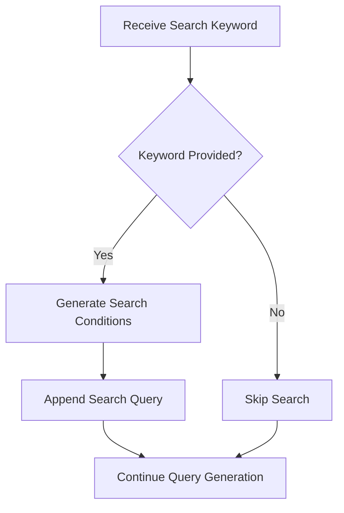

Searching improves data retrieval by allowing users to quickly locate records without specifying multiple filter conditions.

---

# 13. Query Resolver Integration

The Query Resolver is responsible for determining how database queries should be executed.

Before executing a query, it reads the current API Object configuration to determine whether pagination has been enabled.

If pagination is enabled, the Query Resolver invokes `executeQueryWithPagination()`. Otherwise, it executes the query using the standard `executeQuery()` function.

This allows developers to enable advanced query processing through configuration rather than modifying application logic.

## Query Resolver Flow

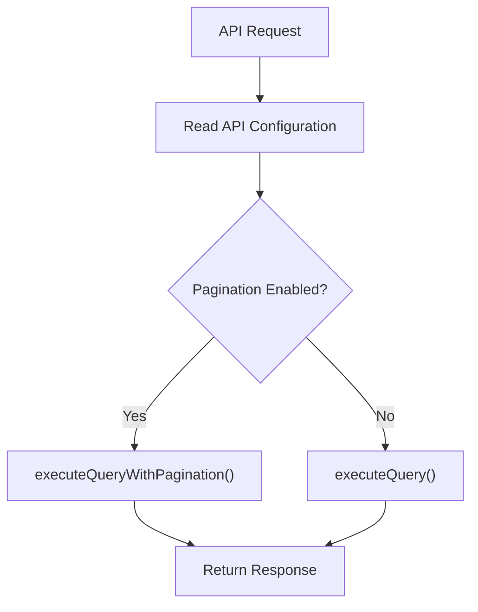

---

# 14. Database Connection

Before executing any SQL query, the framework establishes a database connection.

The connection is created using `requestConnection()`, which loads the configured database connection and prepares it for query execution.

This ensures that every query is executed through a valid database connection.

## Database Connection Flow

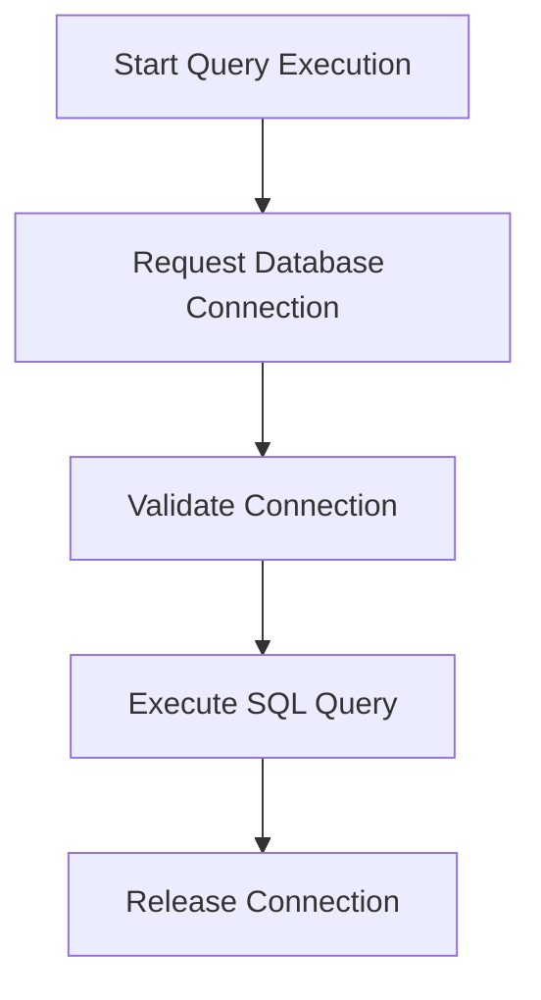

The connection lifecycle consists of the following stages.

| Stage               | Description                                                         |
| ------------------- | ------------------------------------------------------------------- |
| Request Connection  | Obtain a database connection from the configured database.          |
| Validate Connection | Verify that the connection is available before executing the query. |
| Execute Query       | Execute the SQL statement using the active connection.              |
| Release Connection  | Release the database connection after query execution is complete.  |

---

# 15. Dynamic SQL Query Generation

The framework does not execute the original SQL query immediately.

Instead, it dynamically modifies the query according to the request parameters before sending it to the database.

Possible modifications include:

- Search conditions
- Filter conditions
- Sorting
- Pagination
- Column mapping

Each enabled feature contributes to the final SQL query that is executed.

## SQL Query Construction Flow

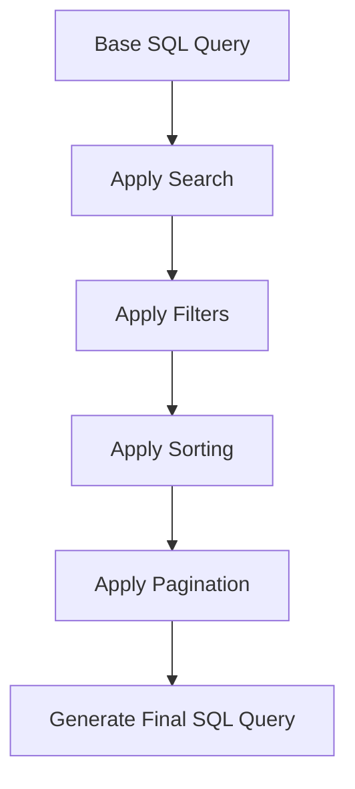

This approach allows a single base query to support multiple request variations without requiring developers to manually construct SQL statements.

### Example

The following example demonstrates how the framework modifies a base SQL query during request processing.

#### Base Query

```sql
SELECT * FROM users;
```

#### Final SQL Query

```sql
SELECT *
FROM user_role_permissions
WHERE role_status = 'active'
ORDER BY role_name ASC
LIMIT 10 OFFSET 20;
```

This example demonstrates how the framework transforms a simple base query into a fully paginated SQL query by automatically applying filtering, sorting, and pagination.

---

# 16. Column Mapping

Different APIs may expose field names that differ from the underlying database column names.

The framework supports column mapping to translate API field names into the corresponding database columns during query generation.

This provides a consistent API interface while allowing the database schema to remain unchanged.

## Column Mapping Process

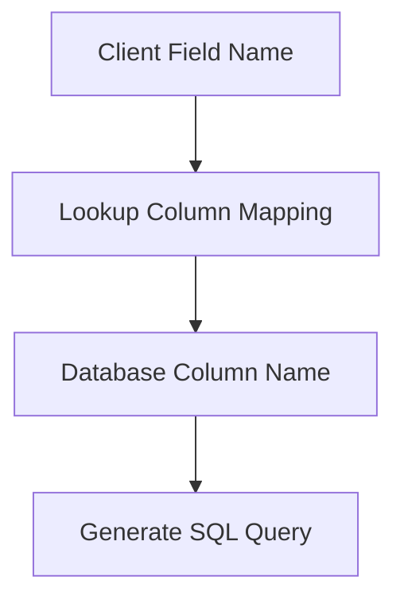

Column mapping improves flexibility by separating the API interface from the database implementation.

---

# 17. Query Execution

Once the final SQL query has been generated, the framework executes it using `executeQuery()`.

This component is responsible for sending the SQL statement to the database and retrieving the resulting records.

The pagination engine focuses on query construction, while the query execution component is responsible for interacting with the database.

## Query Execution Flow

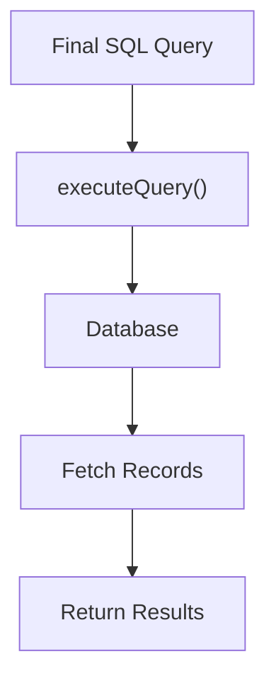

Separating query generation from query execution improves modularity and allows both components to be reused throughout the framework.

---

# 18. Post Processing

After the database returns the query results, additional processing may be performed before the response is returned to the client.

An API Object can specify a `postProcessFunction` to transform, group, or format the retrieved data according to the application's requirements.

For example, the `UserRolePermissionArray` API retrieves role and permission records from the database and groups them into a nested response structure before returning the final result.

## Post Processing Flow

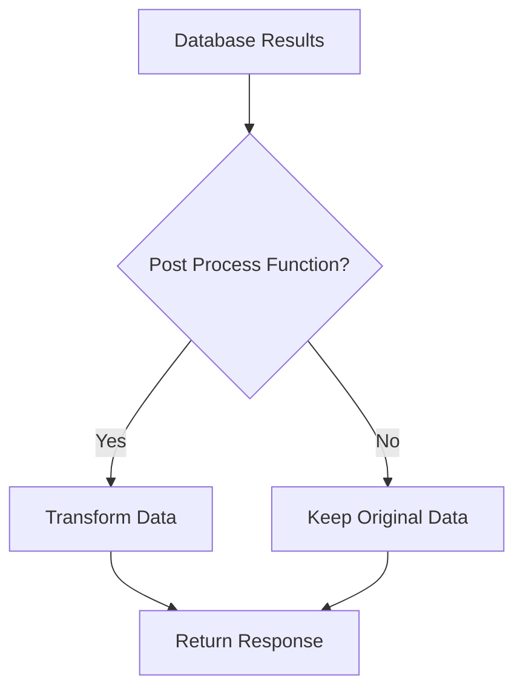

Post processing allows APIs to return responses that are easier for clients to consume without modifying the original SQL query.

---

# 19. Response Structure

After all query processing steps have been completed, the framework returns the final response.

A typical paginated response contains:

- Retrieved records
- Pagination information
- Total number of matching records
- Current page information

### Example

```json
{
  "page": 1,
  "pageSize": 10,
  "totalRecords": 145,
  "data": [
    {
      "id": 1,
      "name": "Administrator"
    }
  ]
}
```

The exact response format depends on the API Object configuration and any post-processing functions applied before returning the response.

---

# 20. Common Errors and Debugging

The following table lists common issues that may occur during paginated query execution along with their possible causes and recommended debugging steps.

| Error                       | Possible Cause                                        | Recommended Debugging                                               |
| --------------------------- | ----------------------------------------------------- | ------------------------------------------------------------------- |
| Pagination not applied      | `features.pagination` is disabled in the API Object.  | Verify that `pagination: true` is enabled in the API configuration. |
| Invalid page number         | The requested page number is missing or invalid.      | Verify the page parameter provided in the request.                  |
| Incorrect page size         | Invalid limit or page size supplied by the client.    | Verify the configured page size and request parameters.             |
| Filtering not working       | Invalid filter field or filter value.                 | Verify that the filter fields match the configured column mappings. |
| Sorting not applied         | Invalid sort column or sort direction.                | Verify the requested sort field and sorting direction.              |
| Search returns no results   | Search keyword does not match any searchable records. | Verify the search keyword and searchable columns.                   |
| Database connection failure | Unable to establish a database connection.            | Verify the database configuration and connection settings.          |
| SQL execution failure       | Invalid SQL query or database error.                  | Review the generated SQL query and database logs.                   |

---

# 21. Best Practices

The following practices are recommended when using `executeQueryWithPagination()` within the framework.

- Enable pagination only for APIs that return large datasets.
- Keep the base SQL query as simple as possible and allow the framework to apply pagination, filtering, and sorting automatically.
- Use column mapping instead of exposing database column names directly to clients.
- Validate request parameters before query execution.
- Use post-processing functions only when additional response transformation is required.
- Avoid manually implementing pagination logic inside individual APIs when the framework already provides this functionality.

Following these practices improves consistency, maintainability, and reusability across the framework.

---

## 22. Request Lifecycle Summary

The following diagram summarizes the complete lifecycle of a paginated request.

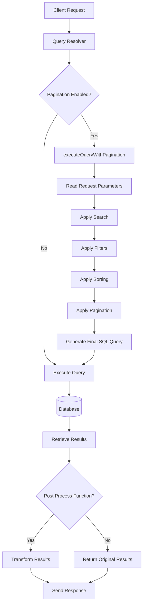

This lifecycle illustrates how the framework processes a request from the moment it is received until the final response is returned to the client.

---

# 23. Related Documentation

The pagination engine is one component of the overall framework architecture.

The following documents explain the remaining components.

| Document                               | Description                                                        |
| -------------------------------------- | ------------------------------------------------------------------ |
| Server Startup + Bootstrap             | Explains how the framework initializes before processing requests. |
| Middleware Pipeline and API Processing | Describes how requests move through the middleware pipeline.       |
| API Creation Process                   | Explains how API Objects are created and configured.               |
| Encryption & Decryption Flow           | Explains how encrypted requests and responses are processed.       |

---

# Conclusion

`executeQueryWithPagination()` provides a centralized and reusable mechanism for executing paginated database queries within the CSAAS framework.

Instead of requiring every API to implement pagination, filtering, sorting, and searching independently, these capabilities are provided by the framework through a configurable query execution component.

By integrating with the Query Resolver, database connection layer, and query execution engine, the pagination component automatically constructs and executes SQL queries based on the current API configuration and incoming request parameters.

This modular architecture reduces duplicate code, improves consistency across APIs, and simplifies the development of scalable database-driven endpoints.

This component plays a central role in the framework by providing a standardized and reusable approach for executing paginated database queries across multiple APIs.

---
