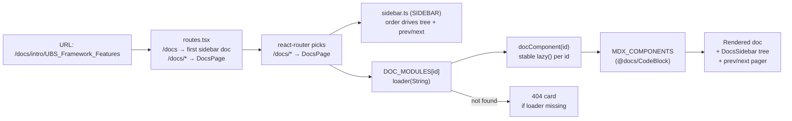

# UBS-Doc Docs Engine — How It Works

> A visual + written explainer of the custom Vite/MDX docs engine that replaced Docusaurus on `feature/vite-design-revamp`.

---

## 1. The big picture

Docusaurus was a **static-site generator**: it took `docs/**/*.md(x)`, compiled them at build time, and shipped a fully rendered site. The revamp replaces it with a **lightweight MDX pipeline inside the Vite SPA** — the docs are compiled to React components at *build* time (via `vite build`), but **loaded lazily at *runtime*** through the router, exactly like every other screen in the app.

Docs are no longer a separate "layer." They are just another route in one React tree, sharing the same shell, design system, auth gates, and bundle.

---

## 2. Pipeline diagram

### Build-time (what happens when you run `npm run build` / `vite build`)

```mermaid
flowchart LR
    subgraph MD[Markdown corpus]
        MD1["docs/<br/>**/*.md"]
        MD2["docs/<br/>**/*.mdx"]
    end

    subgraph VITE["vite.config.ts — the pipeline"]
        A["docs-admonition-titles<br/>(custom pre-plugin)<br/>normalize :::tip Title → :::tip[Title]"]
        B["@mdx-js/rollup<br/>MDX → React components<br/>(remark-gfm, frontmatter,<br/>remarkDirective)"]
        B1["remarkAdmonitions.ts<br/>:::note → .admonition div"]
        B2["remarkDocLinks.ts<br/>./other.md → /docs/other"]
        C["@vitejs/plugin-react<br/>JSX → JS modules"]
    end

    D["`src/docs/docsIndex.ts`<br/>import.meta.glob →<br/>DOC_MODULES map:<br/>'intro/x' → lazy loader"]

    E["dist/assets/<br/>code-split .js chunks"]

    MD1 --> A --> B --> C --> D
    MD2 --> A
    B --> B1
    B --> B2
    D --> E
```

### Runtime (what happens when a user hits `/docs/<id>`)



---

## 3. What happens, step by step

### Build time

1. **`vite.config.ts`** registers a pre-transform plugin (`docs-admonition-titles`) that runs on `.md`/`.mdx` *before* MDX compilation. It normalises Docusaurus's legacy `:::tip Heads up` opener into the bracketed `:::tip[Heads up]` that `remark-directive` can actually parse.
2. **`@mdx-js/rollup`** compiles every markdown file into a React component. Its pipeline:
   - `remark-gfm` → tables, strikethrough, autolinks
   - `remark-frontmatter` + `remark-mdx-frontmatter` → YAML frontmatter becomes props / exported data
   - `remark-directive` → parses `:::type` container directives
   - **`remarkAdmonitions`** → turns `:::note/tip/info/warning/caution/danger` into the `.admonition .admonition-<type>` markup that `docs.css` styles
   - **`remarkDocLinks`** → rewrites bare relative `./other.md` links to `/docs/<id>` routes (otherwise they'd 404)
   - `rehype-slug` → adds `id` anchors to headings for deep links
3. **`docsIndex.ts`** uses Vite's `import.meta.glob` to discover all docs **at build time** and build the `DOC_MODULES` map:
   ```
   "intro/UBS_Framework_Features" → () => Promise<{ default: Component }>
   ```
   The `!/docs/superpowers/**` negative pattern excludes scaffolding.
4. Vite code-splits each doc into its own tiny chunk, so a user only downloads the docs they open.

### Runtime

1. **`routes.tsx`** declares `/docs/*` → `<DocsPage />`. Bare `/docs` redirects to the first sidebar doc.
2. **`DocsPage`** reads `:id` from the URL, looks up its loader in `DOC_MODULES[id]`.
3. **`docComponent(id)`** returns a **stable, cached `lazy()`** component per id (the cache is module-level so router navigations don't re-create the lazy promise and deadlock a transition).
4. The doc renders wrapped in `<MDXProvider>` with `MDX_COMPONENTS` — a custom `prism-react-renderer`-based `pre` (language-aware syntax highlight, dark/light themes) + passthrough inline `code`.
5. **`DocsSidebar`** walks `SIDEBAR` from `sidebar.ts`, auto-opens categories on the active doc's path, and the bottom **Pager** drives prev/next from `flattenSidebar()` order.
6. Missing id → themed **"Document not found"** 404 card.

---

## 4. Adding a NEW doc file — what happens

Drop a file into `docs/`. **That's it for it to be *reachable*.** Every file under `docs/` is routable at `/docs/<path minus the .md(x) and docs/ prefix>`, whether or not it's in the sidebar.

**Example** — you add `docs/portal-guides/reset-password.md`:

```
docs/portal-guides/reset-password.md
```

→ automatically routable at **`/docs/portal-guides/reset-password`**

The new file is:

| Concern | Behavior | Proof |
|---|---|---|
| **Compiled** | Treated as MDX automatically, with admonitions, doc-links, frontmatter, syntax highlighting all working | `mdxExtensions: ['.mdx', '.md']` in vite.config |
| **Routable** | `/docs/portal-guides/reset-password` renders it, navigating directly | `docsIndex.ts` glob + `DocsPage` lookup |
| **Syntax-highlighted** | Fenced ` ```js ` blocks get prism themes (github light / dracula dark) | `<MDXPre>` in `CodeBlock.tsx` |
| **Anchored** | Headings get `id` slugs → `#heading` deep links + anchor jump | `rehype-slug` |
| **In-sidebar?** | **NO — until you add it.** The sidebar tree is explicitly hand-authored, not auto-derived. | `sidebar.ts` |

### To make it *visible* in the sidebar & prev/next pager

Edit `src/docs/sidebar.ts` and add a `string` under the right `{ label, items }` category:

```ts
// before
{
  label: 'Guides',
  items: ['guides/email-branding', 'guides/onboarding'],
},

// after — insert your doc id
{
  label: 'Guides',
  items: [
    'guides/email-branding',
    'guides/onboarding',
    'guides/reset-password',   // ← new
  ],
},
```

💡 The id is the path **relative to** `docs/`, without the `.md` extension. Order in the array = order in the tree **and** in the prev/next pager, so insert where it belongs.

### Verify

```bash
npm test         # a "docs corpus" test recompiles & re-renders every doc — a broken file fails the build's health check
npm run build    # will surface any MDX syntax error in your new file
```

---

## 5. Rules of thumb cheat-sheet

| Action | What the engine does | Do you need to touch anything? |
|---|---|---|
| Add a new doc | Compiled, routable at `/docs/<id>` automatically | `sidebar.ts` (only if it should appear in nav) |
| Give a doc a custom URL/slug | Not supported — the route **is** the file path | — (rename the file instead) |
| Rename / move a doc | Old URL 404s; in-prose `./x.md` links from other docs are rewritten against the *new* path | Update `sidebar.ts`; update `sidebar.test.ts` if it asserts shapes |
| Use `:::note … :::` | Renders as the styled admonition | Nothing |
| Cross-link to another doc | `remarkDocLinks` rewrites bare `.md` targets to `/docs/<id>` | Write `[…](../dir/other.md)` normally |
| Use a custom Component / HTML | MDX lets you embed JSX, components, and raw HTML | Import the component at the top of the doc |

### The two "magic" behaviors worth knowing

1. **Legacy admonition titles are normalised away.** `:::tip Get started` (no brackets) is the Docusaurus idiom; remark-directive needs `:::tip[Get started]`. The `docs-admonition-titles` pre-transform rewrites the former so authors can keep typing the old style.
2. **Bare relative links resolve to routes, not files.** Plain MDX would emit `href="./other.md"` → 404. `remarkDocLinks` resolves the target against the source file's directory under `docs/` and emits `/docs/<resolved id>`, optionally preserving an `#anchor`.

---

## 6. Files that make up the engine

| File | Role |
|---|---|
| `vite.config.ts` | Mdx plugin + pre-transform + the whole remark/rehype stack |
| `src/docs/docsIndex.ts` | The `import.meta.glob` discovery → `DOC_MODULES` id→loader map |
| `src/docs/sidebar.ts` | Hand-authored sidebar tree (ported from Docusaurus) + `flattenSidebar` / `docLabel` / `categoryPathFor` |
| `src/docs/remarkAdmonitions.ts` | Admonition → styled div + the title **normalizer** used pre-MDX |
| `src/docs/remarkDocLinks.ts` | Bare relative doc-link → route remap |
| `src/screens/DocsPage.tsx` | Route handler: loader lookup, lazy component, MDXProvider, pager, 404 |
| `src/components/docs/DocsSidebar.tsx` | Tree UI from `SIDEBAR`, responsive rail/collapsible panel |
| `src/components/docs/CodeBlock.tsx` | Prism-highlighted fenced code + inline code pass-through |
| `src/styles/docs.css` | Docs-specific styling (admonitions, prose, tree) |