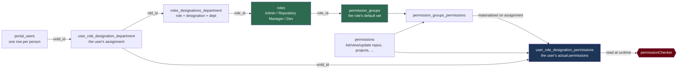
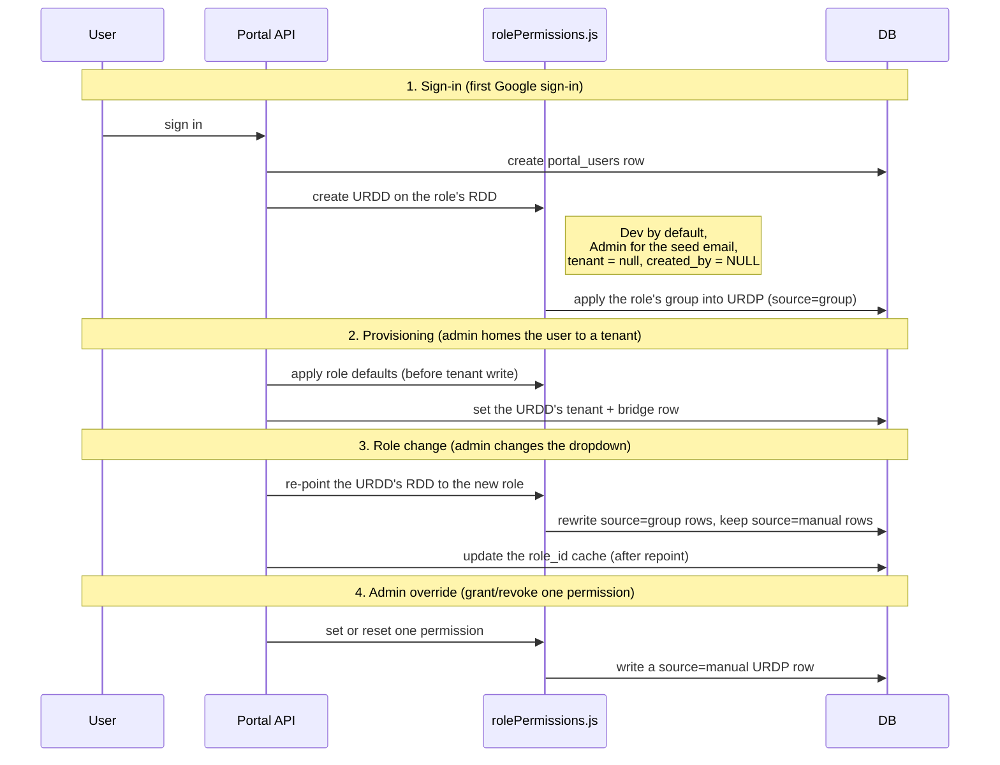
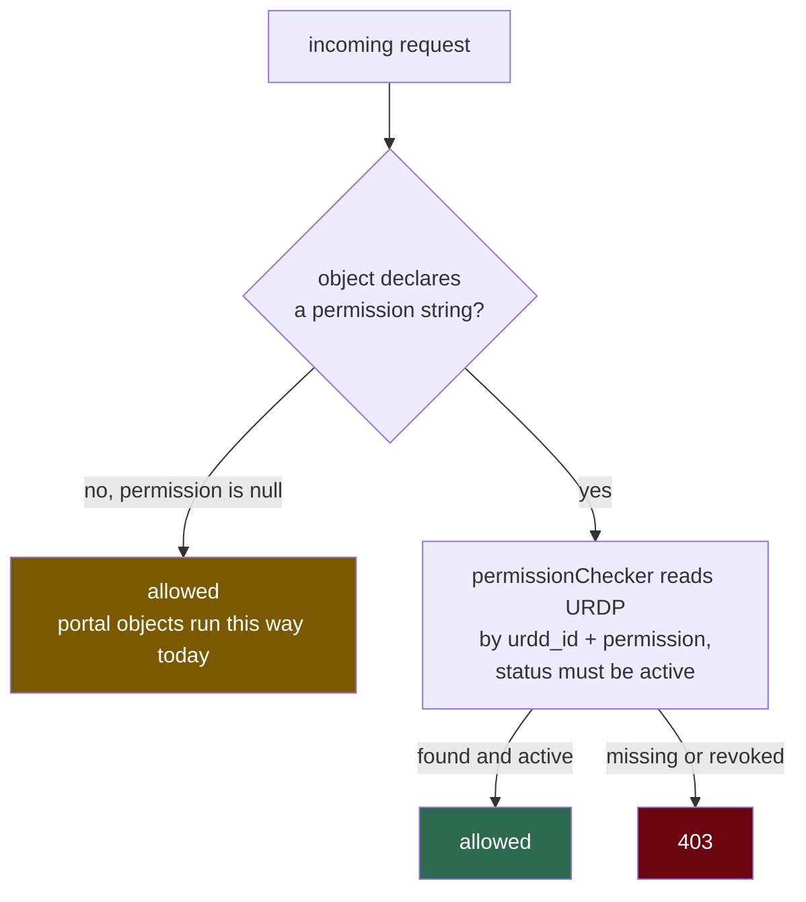

# Role-based permissions: what's shipped

Branch: `flutter-fix` (merged from `feature/role-permission-groups`, 17 commits, `589e010`..`c0812c2`).
Plan: `docs/superpowers/plans/2026-07-17-role-permission-groups.md`. Framework reference: `docs/tenancy/roles-permissions.md`.

## The one-line version

Giving a user a role now grants that role's default permissions automatically, and an admin can add or remove individual permissions on top of that default. The admin's changes survive a later role change. All of it runs on the framework's own RBAC chain, not a side system.

Before this branch, a role granted nothing. Permissions were attached to individual users by hand, one row at a time, and `Repository Manager` existed in name only.

## How the pieces connect

A user is their URDD (user-role-designation-department). The URDD points at an RDD (role-designation-department), which names the role. The role owns a permission group, and that group is copied into the user's URDP (the per-user permission rows) when they get the role. At request time the framework reads URDP to decide access. Nothing here is new framework machinery; we filled in the parts that were missing and wired the portal onto it.

The single source of truth for "what role does this user have" is the join `URDD -> RDD -> roles`. `portal_roles` no longer decides anything; it survives only as the id list the clients still send and receive in dropdowns.

### The two extensions we added to the framework

Everything else is the framework as documented. Two additions, because the product needs something the bare framework does not model. Both are additive and neither changes a framework read path.

1. **A `source` column on URDP, either `group` or `manual`.** The framework copies a group in once and has no idea of an admin override that must outlive a later role change. `source` is how a role resync knows which rows it may rewrite (`group`) and which it must leave alone (`manual`). It defaults to `manual`, so every row that already existed is never swept.

2. **Re-pointing a URDD's RDD in place on a role change.** The framework would model a role change as a brand new URDD, which changes `urdd_id`. Every owned resource is keyed on `urdd_id` through `created_by`, so a new URDD orphans all of it. We update the RDD on the existing URDD instead, so `urdd_id` and ownership stay stable.

## The default permission sets

This is the one thing picked rather than derived from the framework. It is a product call, easy to change later by editing the group rows.

| Role | Default permissions |
|---|---|
| Admin | list/view/update projects, list/view/update repos, update_portal_users, update_permissions |
| Repository Manager | list/view projects, list/view repos, update_repos |
| Dev | list/view projects, list/view repos |

`update_repos` is new. It is what finally gives `Repository Manager` something real to hold.

## The lifecycles

Four moments write the RBAC rows. Here is what each one does.

The load-bearing rule across all four: a role resync only ever touches `source=group` rows. An admin's manual grant or revoke is a `source=manual` row, so it is never swept by a role change. That is the "admin's changes survive" guarantee, in one column.

## The runtime check

Note the gate is currently fail-open for portal objects: they declare `permission: null`, so the check is skipped and URDP is not yet enforced on them. Turning that on is the deferred work (see below). The framework tenancy objects that already carry real permission strings are enforced, and `permissionChecker` is now safe (parameterised) and correct (honours `status`, so a revoked permission actually denies).

## The admin API

Four endpoints, all admin-gated, all transport-only (the logic lives in `rolePermissions.js`). Paths derive from the object names the framework way.

| Endpoint | Method | Purpose |
|---|---|---|
| `/api/portal/permissions/catalog` | GET | List all permissions and each role's default group |
| `/api/portal/permissions/user` | GET | One user's effective permissions, each tagged `group` or `manual` and whether it comes from their role |
| `/api/portal/permissions/set` | POST | Grant or revoke one permission for one user (`active: true/false`), written as `source=manual` |
| `/api/portal/permissions/reset` | POST | Drop the manual override and fall back to the role default |

`user` returns each permission with `source` (`group`/`manual`), `status` (`active`/`inactive`), and `from_role` so the UI can show "this came from the role" versus "an admin set this."

## Bugs fixed along the way

Getting here surfaced real defects, all fixed on this branch:

- **Object registration collision.** Eleven object names were registered in two files each; the loader is last-writer-wins over a directory walk, so filesystem order decided which handler served a route. This caused the `repos/tenant/available` 500 and left the good handler as dead code. Now one owner per object.
- **`permissionChecker` SQL injection.** It interpolated request input straight into SQL on every call. Parameterised, and the injectable dead-code path removed entirely.
- **Revoked permissions still granted access.** `permissionChecker` never filtered `urdp.status`. Now it does.
- **Denials surfaced as HTTP 500.** A handler's thrown `statusCode` was flattened to 500 with the reason buried in the payload. Now a thrown 403 reaches the client as 403. This is a client-visible contract change worth noting for frontend and mobile: code checking `status === 500` to detect a denial should check `403`.

## What's not done yet (PR #2)

One task is deliberately deferred, because it is the only piece that changes who can call a live endpoint and it needs a data backfill after deploy:

- **Turn the gate on.** Flip the repo/project tenancy objects from `permission: null` to real permission strings so URDP is actually enforced on them.
- **Backfill existing users.** Derive each existing user's permissions from their current role and write the `group` rows. Because pre-existing rows are `manual`, the backfill only adds and never removes.
- **Deploy note.** If any target database was built from `base_db.sql` (which ships `permission_groups` without `role_id`/`designation_id`), make the migration's table creation defensive first. Our current test and live DBs lack the table entirely, so the migration is fine as written for them.

Portal endpoints also still authenticate by `actor_email` rather than a verified token. The admin guards stop accidental escalation but are not a hard security boundary; reading the actor from a token is the largest remaining gap and is out of scope for this work.

## Verification

Twelve tenancy test scripts under `Services/SysFunctions/TestScripts/debug/tenancy/` cover this branch: object registration, the safe permission checker, the error-status contract, the group schema, the resolver, sign-in URDD creation, provisioning, role-switch resync, and the admin API. All passed at `c0812c2`. The merge into `flutter-fix` was a fast-forward, so the merged tree is identical to the tested one.

To re-run against a fresh test DB, follow the Phase 4 verification workflow in `CLAUDE.md` (`setupTestDb.js` then the debug scripts).
