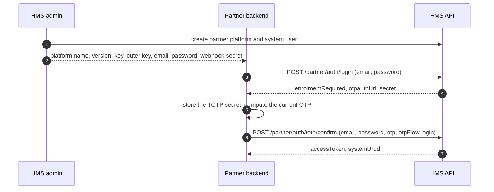
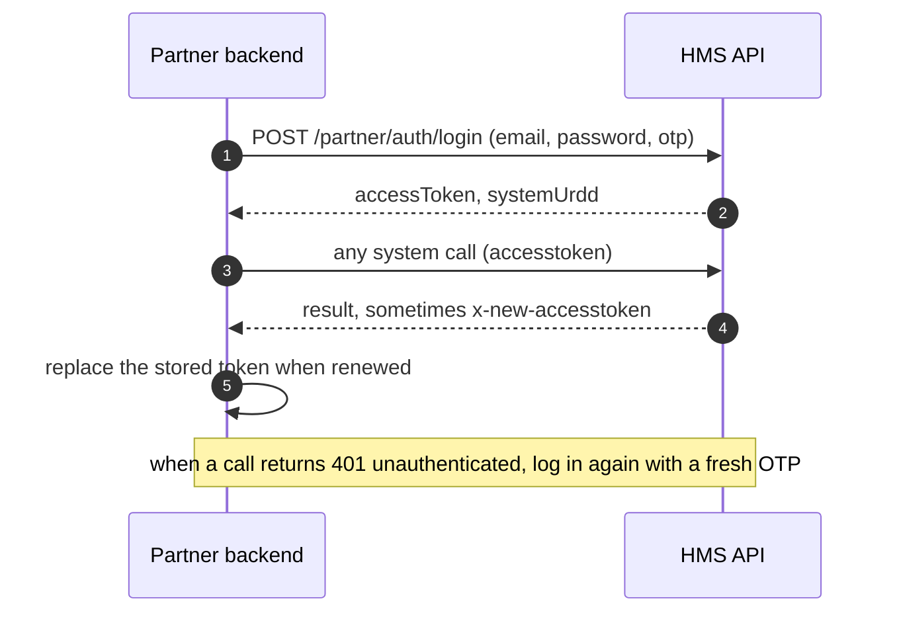
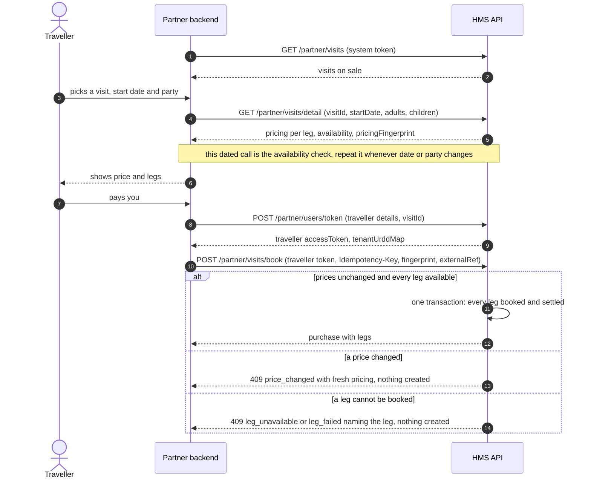
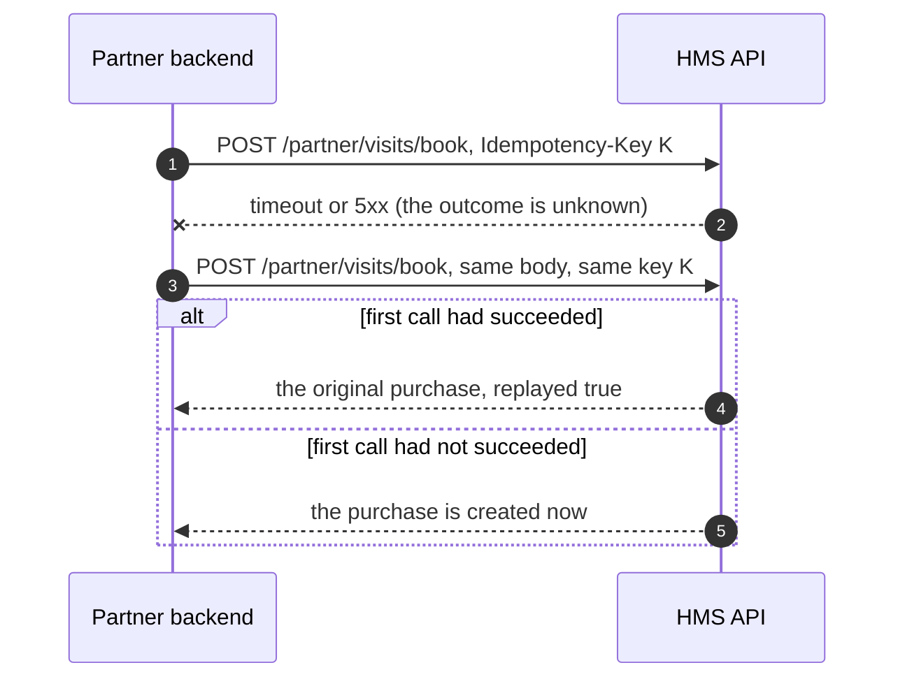
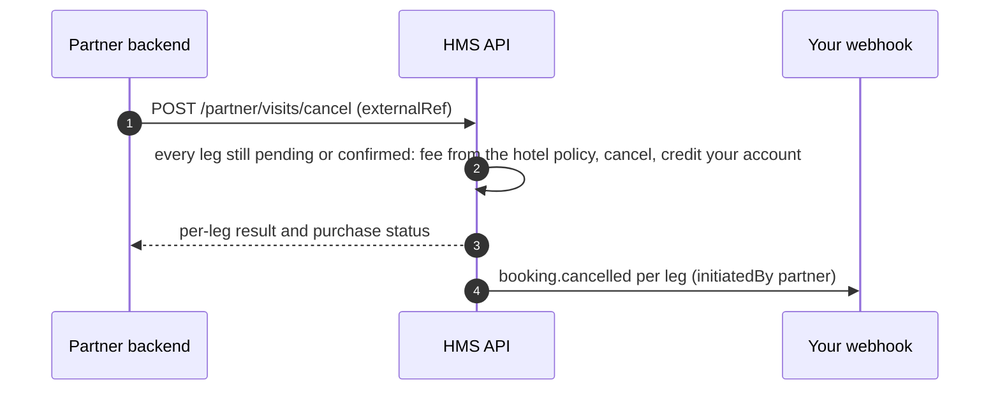
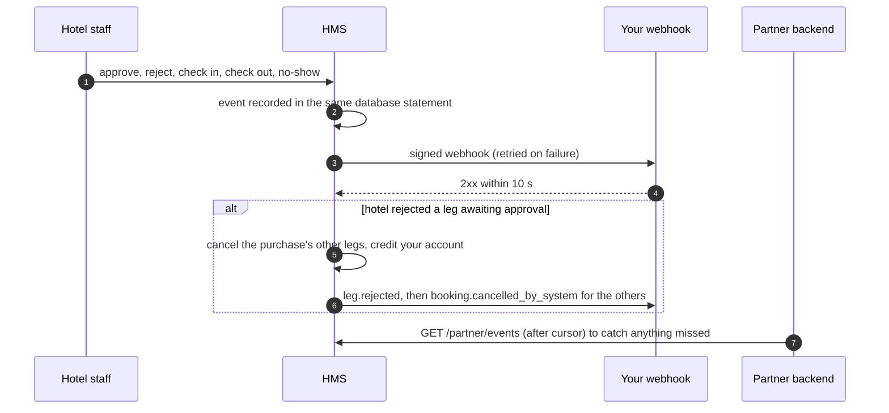

# Partner Integration Guide

This guide is for engineering teams at **partner platforms** (travel apps and websites) that sell HMS **visits** to their own users. It covers everything a partner backend needs: credentials, the encrypted transport, authentication, every endpoint with its request and response, the errors it can return, and the events HMS sends back.

A **visit** is a bundle of hotel packages and services from several hotels, sold at one price. When you book a visit, HMS creates one booking per component (a **leg**) at that component's hotel, all at once: either every leg is created or none is.

| Section | |
|---|---|
| 1. What you receive at onboarding | credentials and settings |
| 2. Transport: the encrypted envelope | how every request and response is encoded |
| 3. Responses and errors | envelope shapes, SCCs, retry guidance |
| 4. End-to-end flows | sequence diagrams |
| 5. Authentication APIs | login, TOTP enrolment and rotation |
| 6. Catalogue APIs | visit list and priced detail |
| 7. Traveller API | traveller token |
| 8. Booking APIs | book, cancel, purchases, leg changes, settle |
| 9. Events | webhooks and replay |
| 10. Integration checklist | before going live |

---

## 1. What you receive at onboarding

HMS creates your platform and hands these over **once, out of band**. Store them in a secret manager.

| Item | Example | Used for |
|---|---|---|
| Base URL | `https://api.<environment>.example/api` | every call; each environment (pre-prod, prod) has its own credentials |
| Platform name | `TravelCo` | `PlatformName` in every envelope |
| Platform version | `1.0.0` | `PlatformVersion` in every envelope |
| Platform key | 32 hex characters | inner encryption layer |
| Outer key | shared string | outer encryption layer |
| System user email + password | `hms@travelco.example.com` / random | partner login |
| Webhook secret | `whsec_…` | verifying webhooks (only if you gave a webhook URL) |

Optional settings HMS records for you: the egress IPs of your servers (calls from other addresses are refused), a rate limit (requests per minute, default 600), your webhook URL, and contacts for incidents and key rotation. Key rotation is done by HMS adding a new platform version with a new key; you switch `PlatformVersion` and key together.

---

## 2. Transport: the encrypted envelope

Every request is **AES-256-ECB, PKCS#7, base64**, using keys cut or right-padded with `0` to 32 characters, in two layers:

```text
innerKey   = (accessToken on authenticated calls, else "") + platformKey
reqData    = AES(JSON(payload), innerKey)
outer      = { reqData, encryptionDetails: { PlatformName, PlatformVersion, accessToken } }
encryptedRequest = AES(JSON(outer), outerKey)
```

| Method | Where `encryptedRequest` goes |
|---|---|
| `POST`, `PUT` | JSON body `{ "encryptedRequest": "<base64>" }` |
| `GET` | header `encryptedrequest: <base64>` (a GET may still carry a payload in `reqData`) |

> **Where every field goes.** All request fields, including `actionPerformerURDD`, go **inside the encrypted payload** (`reqData`), never as plain body or query fields.
> - **POST:** the encrypted envelope is the request body, `{ "encryptedRequest": "<base64>" }`.
> - **GET:** there is no body, so the encrypted envelope goes in the `encryptedrequest` header. Plain query parameters such as `?page=2` are also read on the list GETs, but they travel unencrypted, so prefer the payload.
> - **Authenticated APIs** (every API after section 5) always need the access token twice: in the `accesstoken` header and in `encryptionDetails.accessToken`. Its value is also the first part of `innerKey`. Section 5 login calls and the image call in 6.3 send **no** access token.

| API | Method | Access token | `actionPerformerURDD` |
|---|---|---|---|
| 5.1 to 5.3 login, TOTP confirm, TOTP rotate | `POST` | none | not sent |
| 6.1 list visits, 6.2 visit detail | `GET` | system | `systemUrdd` |
| 6.3 visit images | `GET` | none | not sent |
| 7.1 traveller token | `POST` | system | `systemUrdd` |
| 8.1 book, 8.2 cancel, 8.4 settle, 8.6 schedule | `POST` | traveller | the traveller's `tenantUrddMap.global` |
| 8.5 service slots | `GET` | traveller | the traveller's `tenantUrddMap.global` |
| 8.3 purchases | `GET` | system or traveller | `systemUrdd`, or the traveller's `tenantUrddMap.global` |
| 9.3 events replay | `GET` | system | `systemUrdd` |

Headers on **every** request:

| Header | Value |
|---|---|
| `Content-Type` | `application/json` |
| `x-client-platform` | `web` |
| `x-client-device-uuid` | a stable UUID for your backend |
| `x-app-version` | your integration version, e.g. `1.0.0` |
| `accesstoken` | the current access token, on authenticated calls |
| `Idempotency-Key` | on `POST /api/partner/visits/book` only |

Responses are encrypted with the **same inner key** you used for the request. A renewed access token may arrive in the `x-new-accesstoken` response header at any time; replace your stored token with it immediately, because the previous one stops working.

Reference client (Node.js, `crypto-js`):

```js
const CryptoJS = require("crypto-js");
const axios = require("axios");

const fit = (k) => (k.length > 32 ? k.slice(0, 32) : k.padEnd(32, "0"));
const aes = (obj, key) => CryptoJS.AES.encrypt(JSON.stringify(obj), CryptoJS.enc.Utf8.parse(fit(key)),
  { mode: CryptoJS.mode.ECB, padding: CryptoJS.pad.Pkcs7 }).toString();
const unaes = (text, key) => JSON.parse(CryptoJS.AES.decrypt(text, CryptoJS.enc.Utf8.parse(fit(key)),
  { mode: CryptoJS.mode.ECB, padding: CryptoJS.pad.Pkcs7 }).toString(CryptoJS.enc.Utf8));

async function hms(method, path, body = {}, { token = null, headers = {} } = {}) {
  const inner = `${token || ""}${process.env.HMS_PLATFORM_KEY}`;
  const envelope = {
    reqData: aes(body, inner),
    encryptionDetails: { PlatformName: process.env.HMS_PLATFORM_NAME, PlatformVersion: process.env.HMS_PLATFORM_VERSION, accessToken: token },
  };
  const encryptedRequest = aes(envelope, process.env.HMS_OUTER_KEY);
  const res = await axios({
    method,
    url: process.env.HMS_BASE_URL + path,
    validateStatus: () => true,
    headers: {
      "Content-Type": "application/json",
      "x-client-platform": "web",
      "x-client-device-uuid": process.env.HMS_DEVICE_UUID,
      "x-app-version": "1.0.0",
      ...(token ? { accesstoken: token } : {}),
      ...(method === "GET" ? { encryptedrequest: encryptedRequest } : {}),
      ...headers,
    },
    data: method === "GET" ? undefined : { encryptedRequest },
  });
  const renewed = res.headers["x-new-accesstoken"];
  if (res.status >= 200 && res.status < 300) {
    return { ok: true, status: res.status, renewed, message: res.data.meta?.message, result: unaes(res.data.data, inner).return };
  }
  return { ok: false, status: res.status, scc: res.data?.meta?.scc, message: res.data?.meta?.message, error: res.data?.error };
}
```

---

## 3. Responses and errors

### Success

```json
{ "success": true, "data": "<base64 ciphertext>", "meta": { "message": "Your visit has been booked.", "status": 200, "priority": 1 } }
```

`data` decrypts to `{ "return": <result> }`. Every result shown in this guide is the decrypted `return`, and every path in the **Response fields** tables starts there: `pricing.available` means `return.pricing.available`. A path with `[]` is an array item, so `pricing.legs[].legNet` is the `legNet` of each leg. "Nullable" means the key is always present but its value may be `null`; a field that can be missing says so. `meta.message` is a human sentence in the request's language (`?language_code=ar` for Arabic).

### Error

Errors are **not encrypted**:

```json
{
  "success": false,
  "data": null,
  "meta": {
    "message": "Prices have changed since you priced this visit. Show the new prices and try again.",
    "status": 409,
    "detail": "Prices changed since the detail read; re-display and retry",
    "priority": 4,
    "source": "Visits",
    "scc": "price_changed"
  },
  "error": {
    "message": "Prices changed since the detail read; re-display and retry",
    "detail": "Prices have changed since you priced this visit. Show the new prices and try again.",
    "code": "price_changed",
    "source": "Visits",
    "details": { "code": "price_changed", "pricing": { } }
  }
}
```

| Field | Use it for |
|---|---|
| `meta.scc` (= `error.code`) | **branching** in your code |
| `meta.message` | a sentence you may show to your user |
| `error.details` | structured data for some errors (fresh pricing, the failing leg, `lockedUntil`, …) |
| `meta.detail` | developer text for your logs; do not show it to users |

### Framework errors (any endpoint)

| HTTP | SCC | Meaning | What to do |
|---|---|---|---|
| 400 | `E10` | the envelope could not be decrypted, or a required field is missing | check keys, platform name and version, payload |
| 400 | `E51` | platform not accepted for this endpoint | check `PlatformName` |
| 401 | `unauthenticated` | access token missing, expired, revoked or bound to another platform | log in again (system) or issue a new traveller token |
| 403 | `E31` | the actor lacks the permission for this endpoint | wrong `actionPerformerURDD` for the token |
| 404 | `E50` | unknown endpoint | check the path |
| 405 | `E52` | wrong HTTP method | check the method |
| 429 | `rate_limited` | over your per-minute limit | back off and retry after a minute |
| 500 | `E99`, `E22` | server fault | retry with backoff; book calls are safe to retry with the same `Idempotency-Key` |

### Partner errors on every partner endpoint

| HTTP | SCC | Meaning |
|---|---|---|
| 403 | `not_a_partner_platform` | the platform in the envelope is not an active partner |
| 403 | `ip_not_allowed` | the call came from an address outside your registered egress IPs |
| 403 | `wrong_token` | a system token was used where a traveller token is needed, or the reverse, or the token belongs to another platform |
| 403 | `persona_mismatch` | `actionPerformerURDD` does not belong to the token's user, or is not the right kind of seat |
| 409 | `concurrent_request` | another request for the same purchase is in progress; retry shortly |

---

## 4. End-to-end flows

### 4.1 Onboarding and first login



### 4.2 Daily session



### 4.3 Browse, price and book



### 4.4 Safe retry



### 4.5 Cancellation



### 4.6 Hotel-side changes



Hotel staff can only move a visit leg through its statuses: approve or reject a pending leg, check in, check out, mark a no-show. They cannot change a leg's dates, party, price or services, and cannot cancel a confirmed leg.

### 4.7 After booking

A booked visit cannot be changed: there is no edit, extension, reschedule or add-on for a leg, from your platform or from the hotel. To change a trip, cancel the whole visit (4.5) and book again. If a leg ever shows a `balanceDue` above 0, settle it with `POST /partner/visits/legs/settle` (8.4).

---

## 5. Authentication APIs

The partner backend signs in as its **system user**. There is no refresh token: when the access token expires, log in again. TOTP is RFC 6238 (SHA-1, 6 digits, 30-second period, ±1 step); compute it from the stored secret with any standard TOTP library. Each OTP is accepted **once**: a second call in the same 30-second step needs the next code.

These three endpoints use the envelope **without** an access token: no `accesstoken` header, `encryptionDetails.accessToken` is `null`, and `innerKey = platformKey`. Don't send `actionPerformerURDD` either, since you don't have one until login returns `systemUrdd`. The encrypted payload is the POST body `{ "encryptedRequest": "<base64>" }`.

### 5.1 Login — `POST /api/partner/auth/login`

**Request**

| | |
|---|---|
| Method | `POST /api/partner/auth/login` |
| Access token | none, so send no `accesstoken` header and use `innerKey = platformKey` |
| `actionPerformerURDD` | not sent |
| Encrypted payload goes in | the JSON body `{ "encryptedRequest": "<base64>" }` |

Payload (the JSON inside `reqData`, before encryption):

```json
{ "email": "hms@travelco.example.com", "password": "S3cr3t…", "otp": "117604" }
```

| Field | Type | Required | Notes |
|---|---|---|---|
| `email` | string | yes | system user email |
| `password` | string | yes | |
| `otp` | string | after enrolment | 6 digits |

Before enrolment, call without `otp`:

```json
{ "email": "hms@travelco.example.com", "password": "S3cr3t…" }
```

```json
{ "enrolmentRequired": true,
  "otpauthUri": "otpauth://totp/HMS:hms%40travelco.example.com%20(TravelCo)?secret=JBSWY3DPEHPK3PXP&issuer=HMS&algorithm=SHA1&digits=6&period=30",
  "secret": "JBSWY3DPEHPK3PXP" }
```

Calling again before confirming replaces the pending secret. After enrolment:

```json
{ "email": "hms@travelco.example.com", "password": "S3cr3t…", "otp": "117604" }
```

```json
{ "accessToken": "eyJhbGciOi…", "expiresIn": 86400, "tokenType": "partner_system",
  "systemUrdd": 4410, "platform": { "id": 8, "name": "TravelCo" } }
```

Send `systemUrdd` as `actionPerformerURDD` on every system call.

**Response fields.** The result has one of two shapes. Before enrolment (no `otp` sent and no active TOTP):

| Path | Type | Nullable | Values and notes |
|---|---|---|---|
| `enrolmentRequired` | boolean | no | always `true` in this shape |
| `otpauthUri` | string | no | `otpauth://totp/<issuer>:<email> (<platform>)?secret=…&issuer=…&algorithm=SHA1&digits=6&period=30`; load it into an authenticator or TOTP library |
| `secret` | string | no | the same secret in base32, 32 characters |

After enrolment, with a valid `otp`:

| Path | Type | Nullable | Values and notes |
|---|---|---|---|
| `accessToken` | string | no | the system token (JWT) |
| `expiresIn` | number | no | lifetime in seconds |
| `tokenType` | string | no | always `partner_system` |
| `systemUrdd` | number | no | send as `actionPerformerURDD` on every system call |
| `platform.id` | number | no | your platform id |
| `platform.name` | string | no | your platform name |

| HTTP | SCC | When |
|---|---|---|
| 400 | `credentials_required` | email or password missing |
| 400 | `otp_required` | enrolled but no `otp` |
| 401 | `invalid_credentials` | wrong email or password |
| 401 | `invalid_otp` | wrong OTP, or already used |
| 403 | `totp_revoked` | HMS revoked your TOTP; contact HMS |
| 409 | `totp_confirm_required` | `otp` sent while enrolment is still pending |
| 423 | `locked` | five failures in a row; `error.details.lockedUntil` (15 minutes) |

### 5.2 Confirm a pending secret — `POST /api/partner/auth/totp/confirm`

**Request**

| | |
|---|---|
| Method | `POST /api/partner/auth/totp/confirm` |
| Access token | none, so send no `accesstoken` header and use `innerKey = platformKey` |
| `actionPerformerURDD` | not sent |
| Encrypted payload goes in | the JSON body `{ "encryptedRequest": "<base64>" }` |

Payload (the JSON inside `reqData`, before encryption):

```json
{ "email": "hms@travelco.example.com", "password": "S3cr3t…", "otp": "492039", "otpFlow": "login" }
```

| Field | Type | Required | Notes |
|---|---|---|---|
| `email`, `password` | string | yes | |
| `otp` | string | yes | from the **pending** (new) secret |
| `otpFlow` | `login` \| `rotation` | yes | `login` finishes enrolment, `rotation` finishes a rotation |

`otpFlow: login` returns the login response plus `"enrolled": true`. `otpFlow: rotation` returns `{ "rotated": true }` and no token; your session carries on.

**Response fields**

| Path | Type | Nullable | Values and notes |
|---|---|---|---|
| `enrolled` | boolean | no | `otpFlow: login` only, always `true` |
| `accessToken`, `expiresIn`, `tokenType`, `systemUrdd`, `platform.id`, `platform.name` | | no | `otpFlow: login` only, as in the login session response (5.1) |
| `rotated` | boolean | no | `otpFlow: rotation` only, always `true`; no token fields are returned |

| HTTP | SCC | When |
|---|---|---|
| 400 | `invalid_otp_flow` | `otpFlow` is neither `login` nor `rotation` |
| 401 | `invalid_otp` | wrong OTP for the pending secret |
| 409 | `otp_flow_mismatch` | no enrolment (for `login`) or no rotation (for `rotation`) is pending |
| | | plus `credentials_required`, `invalid_credentials`, `locked`, `totp_revoked` as for login |

### 5.3 Start a rotation — `POST /api/partner/auth/totp/rotate`

**Request**

| | |
|---|---|
| Method | `POST /api/partner/auth/totp/rotate` |
| Access token | none, so send no `accesstoken` header and use `innerKey = platformKey` |
| `actionPerformerURDD` | not sent |
| Encrypted payload goes in | the JSON body `{ "encryptedRequest": "<base64>" }` |

Payload (the JSON inside `reqData`, before encryption):

```json
{ "email": "hms@travelco.example.com", "password": "S3cr3t…", "otp": "117604" }
```

`{ email, password, otp }`, with `otp` from the **current** secret. Returns `{ "rotationPending": true, "otpauthUri": "…", "secret": "…" }`. The old secret keeps working until you confirm with `otpFlow: rotation`.

**Response fields**

| Path | Type | Nullable | Values and notes |
|---|---|---|---|
| `rotationPending` | boolean | no | always `true` |
| `otpauthUri` | string | no | the **new** secret's URI, same format as in 5.1 |
| `secret` | string | no | the new secret in base32 |

| HTTP | SCC | When |
|---|---|---|
| 409 | `totp_not_active` | not enrolled yet |
| 401 | `invalid_otp` | wrong OTP from the current secret |
| | | plus `credentials_required`, `invalid_credentials`, `locked`, `totp_revoked` |

---

## 6. Catalogue APIs

System token; `actionPerformerURDD` = `systemUrdd`.

### 6.1 List visits — `GET /api/partner/visits`

**Request**

| | |
|---|---|
| Method | `GET /api/partner/visits` |
| Access token | **required**, the **system** token in the `accesstoken` header (and in `encryptionDetails.accessToken`) |
| `actionPerformerURDD` | `systemUrdd` |
| Encrypted payload goes in | the `encryptedrequest` header |

Payload (the JSON inside `reqData`, before encryption):

```json
{ "actionPerformerURDD": 4410, "page": 1, "pageSize": 20 }
```


Fields: `page` (default 1, alias `page_no`), `pageSize` (default 20, max 100, alias `page_size`). Only visits currently on sale are returned (published, every hotel active and participating, priced).

```json
{ "items": [
    { "dto": "PartnerVisitV1", "id": 42, "visitCode": "MKK-MDN-5N", "name": "Makkah and Madinah, 5 nights",
      "description": "…", "availableFrom": "2026-11-01", "availableTo": "2027-03-31", "durationDays": 5,
      "price": { "amount": 6000, "listAmount": 6000, "currency": "SAR" },
      "legs": [
        { "legNo": 1, "type": "package", "recordId": 367, "name": "Generosity Umrah Package", "hotelId": 86,
          "hotelName": "Le Meridien Makkah", "category": null, "dayOffset": 0, "nights": 3, "quantity": 1 },
        { "legNo": 2, "type": "package", "recordId": 422, "name": "Romance Escape", "hotelId": 106,
          "hotelName": "Sample Grand Hotel II", "category": null, "dayOffset": 3, "nights": 2, "quantity": 1 } ],
      "configs": { "display_name": { "en": "Makkah and Madinah", "ar": "مكة والمدينة" }, "is_featured": "true",
                   "base_currency": "SAR", "media": ["201", "202"] }, "updatedAt": "2026-10-04T10:07:00Z", "etag": "W/\"7b0c19f2a1\"" } ],
  "pagination": { "page": 1, "pageSize": 20, "totalItems": 1, "totalPages": 1 } }
```

`availableFrom` / `availableTo` bound the trip: any start date works as long as the whole trip, from `startDate` to `startDate` + `durationDays` nights, falls inside them. Either may be `null` (open-ended). `durationDays` is the visit's length in nights. `dayOffset` is the day of the visit a leg starts on.

`quantity` on a package leg is how many packages each purchase books (parallel rooms). The party is split across them, and a party too large for that many packages books more. `componentPrice` already includes every package booked.


**Response fields.** `items[]` is a list of visit objects. The same visit object is the result of 6.2, so these paths apply there too without the `items[].` prefix.

| Path | Type | Nullable | Values and notes |
|---|---|---|---|
| `items[].dto` | string | no | always `PartnerVisitV1`; changes only with a new contract version |
| `items[].id` | number | no | the `visitId` for 6.2 and 8.1 |
| `items[].visitCode` | string | no | `VIS-` and 6 letters or digits, e.g. `VIS-441DPG` |
| `items[].name` | string | no | |
| `items[].description` | string | yes | |
| `items[].availableFrom` | `YYYY-MM-DD` | yes | first day a trip may start; `null`: no lower bound |
| `items[].availableTo` | `YYYY-MM-DD` | yes | last day a trip may end; `null`: open-ended |
| `items[].durationDays` | number | yes | trip length in nights |
| `items[].price` | object | yes | the visit's sell price; `null` only when the visit has no active price (it is then not listed in 6.1) |
| `items[].price.amount` | number | no | current sell price, after any active discount |
| `items[].price.listAmount` | number | no | list price before discount; equal to `amount` when there is none |
| `items[].price.currency` | string | no | ISO currency code, e.g. `SAR` |
| `items[].legs[]` | array | no | the itinerary in order, at least one leg |
| `items[].legs[].legNo` | number | no | 1, 2, 3, … in itinerary order |
| `items[].legs[].type` | string | no | `package` or `service` |
| `items[].legs[].recordId` | number | no | the package id or service id at the hotel |
| `items[].legs[].name` | string | no | the package or service name |
| `items[].legs[].hotelId` | number | no | |
| `items[].legs[].hotelName` | string | no | |
| `items[].legs[].category` | string | yes | service legs only: the service category slug, e.g. `dining`, `transport`, `spa`. Always `null` on package legs |
| `items[].legs[].dayOffset` | number | no | day of the trip the leg starts on, `0` = `startDate` |
| `items[].legs[].nights` | number | no | package legs: the package's nights plus any extra nights. Service legs: `0` |
| `items[].legs[].quantity` | number | no | package legs: packages booked per purchase (parallel rooms). Service legs: units booked |
| `items[].configs` | object | no | the visit's display settings by config key; `{}` when none (see below) |
| `items[].updatedAt` | ISO 8601 datetime | no | last change to the visit |
| `items[].etag` | string | no | e.g. `W/"edfe4b465a207d255849"`; changes when the visit, its legs, price or configs change |
| `pagination.page` | number | no | |
| `pagination.pageSize` | number | no | |
| `pagination.totalItems` | number | no | visits on sale |
| `pagination.totalPages` | number | no | `0` when there are none |

`configs` has one key per config the visit has; keys that are not set are absent, and HMS may add keys over time, so ignore ones you don't use. Each value follows these rules:

| Config | Value |
|---|---|
| a text value with an Arabic translation | `{ "en": "…", "ar": "…" }` |
| a text or number value without a translation | a string, e.g. `"3"`, `"2026-10-31 00:00:00"`; JSON text is returned parsed |
| an option (chosen from a list) | the option's value, e.g. `duration_unit` = `{ "value": "Nights", "key": "nights" }` |
| `base_currency` | a currency code string, e.g. `"SAR"` |
| a multi-value key (e.g. `media`, `allowed_regions`) | an array of the values above, e.g. `media` = `["1520", "1521"]` (attachment ids for 6.3) |

Keys you will commonly see: `display_name`, `media`, `is_featured`, `base_price`, `base_currency`, `duration`, `duration_unit`, `publish_start_datetime`, `publish_end_datetime`, `advance_booking_min_days`, `advance_booking_max_days`, `min_persons_per_booking`, `max_persons_per_booking`, `max_adults`, `max_children`, `allowed_regions` (an array with one object mapping a region id to its city ids).


### 6.2 Visit detail and live pricing — `GET /api/partner/visits/detail`

**Request**

| | |
|---|---|
| Method | `GET /api/partner/visits/detail` |
| Access token | **required**, the **system** token in the `accesstoken` header (and in `encryptionDetails.accessToken`) |
| `actionPerformerURDD` | `systemUrdd` |
| Encrypted payload goes in | the `encryptedrequest` header |
| Catalogue mode | send only `actionPerformerURDD` and `visitId` (optionally `ifNoneMatch`) |

Payload (the JSON inside `reqData`, before encryption):

```json
{ "actionPerformerURDD": 4410, "visitId": 42, "startDate": "2026-11-02", "adults": 2, "children": 1 }
```

This is the availability check for a visit. There is no separate availability API. The call has two modes:

| Mode | Send | You get | Use it for |
|---|---|---|---|
| Catalogue | `visitId` only | the same DTO as one item of 6.1, plus `ifNoneMatch` support | refreshing one cached visit (deep link, stale card); optional, since 6.1 already returns this data |
| Availability and quote | `visitId`, `startDate`, `adults` (and `children`) | the DTO plus `pricing`: `available`, `violations`, the live price per leg and `pricingFingerprint` | every time the traveller picks or changes a date or party; required before booking |

**Why only a start date.** A visit is a fixed itinerary, so the traveller picks only the day it starts. Every other date is derived from it, so no end date is accepted:

- leg check-in = `startDate` + the leg's `dayOffset`
- leg check-out = check-in + the leg's `nights`
- trip end = `startDate` + `durationDays`

The response's `pricing.legs[].checkIn` / `checkOut` carry the computed dates.

For example, visit 42 has leg 1 with `dayOffset` 0 and 3 nights, then leg 2 with `dayOffset` 3 and 2 nights, so `durationDays` is 5. A `startDate` of `2026-11-02` gives:

| Leg | Check-in | Check-out |
|---|---|---|
| 1 | 2026-11-02 | 2026-11-05 |
| 2 | 2026-11-05 | 2026-11-07 |

The trip ends on 2026-11-07. Any other end date would describe a different trip, so HMS doesn't accept one, and an `endDate` field is ignored. To offer a longer or shorter trip, HMS sells it as a separate visit.

**Recommended flow**

1. Show visits from 6.1. You may cache them by `etag`.
2. Offer start dates from `availableFrom` up to `availableTo` − `durationDays`, so the whole trip fits the window.
3. When the traveller picks a date and party, call this endpoint with `startDate`, `adults` and `children`.
4. If `available` is `false`, show the `violations`. Where a leg has `nextAvailable`, offer it as a hint for another start date, then repeat step 3.
5. If `available` is `true`, show `sellAmount`, keep `pricingFingerprint`, and book with the same `startDate`, `adults` and `children` (8.1). A change to the date or party needs a new call here first.

| Field | Type | Required | Notes |
|---|---|---|---|
| `visitId` | number | yes | |
| `startDate` | `YYYY-MM-DD` | for pricing | first day of the visit |
| `adults` | number ≥ 1 | with `startDate` | |
| `children` | number ≥ 0 | no | default 0 |
| `ifNoneMatch` | string | no | an `etag`; returns `{ "notModified": true, "etag": … }` when nothing changed (ignored when pricing) |

Without `startDate` the result is the visit DTO above. With it, `pricing` is added, computed live with each hotel's own rules at each leg's own date:

```json
{ "dto": "PartnerVisitV1", "id": 42, "…": "…",
  "pricing": {
    "startDate": "2026-11-02", "adults": 2, "children": 1, "available": true, "violations": [],
    "currency": "SAR", "sellAmount": 6000, "componentSum": 6300, "bundleDiscount": 300,
    "pricingFingerprint": "sha256:9b1c4e…",
    "legs": [
      { "legNo": 1, "type": "package", "recordId": 367, "hotelId": 86, "name": "Generosity Umrah Package",
        "checkIn": "2026-11-02", "checkOut": "2026-11-05", "componentPrice": 3600, "allocatedDiscount": 171.43, "legNet": 3428.57 },
      { "legNo": 2, "type": "package", "recordId": 422, "hotelId": 106, "name": "Romance Escape",
        "checkIn": "2026-11-05", "checkOut": "2026-11-07", "componentPrice": 2400, "allocatedDiscount": 114.29, "legNet": 2285.71 } ] } }
```

When `available` is `false`, `violations` lists each blocked leg:

```json
"violations": [ { "legNo": 2, "hotelId": 106, "nextAvailable": { "availableFrom": "2026-11-09", "availableTo": "2026-11-11" },
                  "violations": [ { "rule": "weekday_arrival_restriction", "message": "This package is only available with check-in on: fri, sat" } ] } ]
```

**Response fields.** The call has three result shapes:

1. Catalogue mode: the visit object, as one `items[]` entry of 6.1 (same paths without `items[].`), plus `legs[].services[]` below.
2. Catalogue mode with a matching `ifNoneMatch`: only `notModified` (always `true`) and `etag`.
3. Availability and quote mode: the visit object with `legs[].services[]`, plus `pricing`. `available` is **inside** `pricing` because it answers for this `startDate` and party only; there is no top-level `available`.

Fields only the detail call returns (6.1 does not, to keep the list light):

| Path | Type | Nullable | Values and notes |
|---|---|---|---|
| `legs[].services[]` | array | no | service legs: the service itself. Package legs: every service in the package, including the stay |
| `legs[].services[].serviceId` | number | no | use it in `legs[].scheduling.services[]` (8.1), 8.5 and 8.6 |
| `legs[].services[].name` | string | no | |
| `legs[].services[].category` | string | yes | category slug, e.g. `stay`, `dining`, `spa`, `transport`; tells you which scheduling block applies |
| `legs[].services[].formSchema[]` | array | no | the form to collect for this service, see 6.4; `[]` when the hotel asks for nothing |

| Path | Type | Nullable | Values and notes |
|---|---|---|---|
| `pricing` | object | | present only when `startDate` was sent |
| `pricing.startDate` | `YYYY-MM-DD` | no | as sent |
| `pricing.adults` | number | no | as sent |
| `pricing.children` | number | no | as sent, `0` by default |
| `pricing.available` | boolean | no | `true` when `violations` is empty: every leg can be booked for this date and party |
| `pricing.violations[]` | array | no | one entry per blocked leg; `[]` when `available` is `true` |
| `pricing.violations[].legNo` | number | no | |
| `pricing.violations[].hotelId` | number | no | |
| `pricing.violations[].violations[]` | array | no | the rules this leg breaks, at least one |
| `pricing.violations[].violations[].rule` | string | no | a rule code from the table below |
| `pricing.violations[].violations[].message` | string | no | English explanation, for logs or display |
| `pricing.violations[].violations[].unitsNeeded` | number | | only on `insufficient_units` and `insufficient_capacity`: rooms the party needs |
| `pricing.violations[].violations[].unitsAvailable` | number | | only on `insufficient_units`: rooms free for those dates |
| `pricing.violations[].violations[].capacity` | number | | only on `insufficient_capacity`: guests those rooms hold |
| `pricing.violations[].violations[].guests` | number | | only on `insufficient_capacity`: guests requested |
| `pricing.violations[].nextAvailable` | object | yes | the earliest free dates for this leg in the next 30 days, as a hint for another `startDate`; `null` when none or not computed |
| `pricing.violations[].nextAvailable.availableFrom` | `YYYY-MM-DD` | no | leg check-in that would be free |
| `pricing.violations[].nextAvailable.availableTo` | `YYYY-MM-DD` | no | its check-out |
| `pricing.currency` | string | no | ISO currency code of every amount below |
| `pricing.sellAmount` | number | no | what the traveller pays for the whole visit |
| `pricing.componentSum` | number | no | the legs' own prices added up |
| `pricing.bundleDiscount` | number | no | `componentSum` − `sellAmount`; negative when the visit sells above its parts |
| `pricing.pricingFingerprint` | string | no | `sha256:` and 64 hex characters; send it to 8.1 |
| `pricing.legs[]` | array | no | one entry per leg, in `legNo` order |
| `pricing.legs[].legNo` | number | no | |
| `pricing.legs[].type` | string | no | `package` or `service` |
| `pricing.legs[].recordId` | number | no | |
| `pricing.legs[].hotelId` | number | no | |
| `pricing.legs[].name` | string | no | |
| `pricing.legs[].checkIn` | `YYYY-MM-DD` | no | `startDate` + `dayOffset` |
| `pricing.legs[].checkOut` | `YYYY-MM-DD` | no | package legs: `checkIn` + `nights`. Service legs: same as `checkIn` |
| `pricing.legs[].componentPrice` | number | no | the leg's own price with the hotel's rules for that date; for a package leg it covers every package booked |
| `pricing.legs[].allocatedDiscount` | number | no | this leg's share of `bundleDiscount` |
| `pricing.legs[].legNet` | number | no | `componentPrice` − `allocatedDiscount`; what the hotel is paid. The legs' `legNet` add up to `sellAmount` exactly |

Rule codes in `violations[].rule`:

| Rule | Leg type | Meaning |
|---|---|---|
| `publish_window` | any | the leg's dates fall outside the component's publish window |
| `advance_booking_min_days` | any | the leg starts too soon |
| `advance_booking_max_days` | any | the leg starts too far ahead |
| `blackout_dates` | any | the leg's date is blacked out |
| `max_quantity_per_booking` | any | more units than the component allows per booking |
| `min_persons_per_booking`, `max_persons_per_booking` | any | the party is too small or too large |
| `weekday_arrival_restriction` | package | check-in is not on an allowed weekday |
| `package_duration` | package | the stay is not a whole number of package periods |
| `extra_nights` | package | more extra nights than the package allows |
| `insufficient_units` | package | not enough rooms free for these dates |
| `insufficient_capacity` | package | the free rooms cannot hold the party |
| `entries`, `entries_duration`, `entries_continuity`, `entries_factor`, `entries_quantity` | package | the multi-room request for a quantity above 1 is invalid for this package |
| `probe_failed` | package | availability could not be checked; retry |
| `is_amenity` | service | the service is an amenity and cannot be booked on its own |

Keep `pricingFingerprint` for the book call. It never expires: it stays valid exactly as long as every price it covers is unchanged.

| HTTP | SCC | When |
|---|---|---|
| 400 | `visit_id_required` | |
| 404 | `visit_not_found` | unknown, unpublished or withdrawn visit |
| 409 | `visit_unavailable` | a component or hotel stopped participating; `error.details.legs` |
| 409 | `visit_empty` | the visit has no components |
| 409 | `visit_not_priced` | the visit has no active price |
| 409 | `currency_mismatch` | a leg is priced in another currency |
| 422 | `invalid_start_date` | not `YYYY-MM-DD` |
| 422 | `outside_sellable_window` | The trip (`startDate` to `startDate` + `durationDays`) is not inside `availableFrom`/`availableTo`; `error.details` carries the window and the computed trip dates |
| 422 | `invalid_party` | `adults` < 1 or `children` < 0 |


### 6.3 Visit images — `GET /api/upload/serve`

**Request**

| | |
|---|---|
| Method | `GET /api/upload/serve` |
| Access token | none, so send no `accesstoken` header and use `innerKey = platformKey` |
| `actionPerformerURDD` | not sent |
| Encrypted payload goes in | the `encryptedrequest` header |
| Alternative | the same envelope URL-encoded as `?encryptedRequest=<base64>` |

Payload (the JSON inside `reqData`, before encryption):

```json
{ "attachmentId": 201 }
```

`media` holds attachment ids. To get an image's bytes, call the HMS file endpoint with your platform key and **no access token**:

| Field | Type | Required | Notes |
|---|---|---|---|
| `attachmentId` | number | yes | an id from `configs.media` |

Use the same envelope as any other call, with `innerKey = platformKey`. Send it in the `encryptedrequest` header, or URL-encoded as `?encryptedRequest=<base64>`. A success returns the raw file (for example `image/jpeg`), not a JSON envelope, with `Cache-Control: public, max-age=86400`. A refusal returns the usual JSON error with `403`.

Catalogue imagery and hotel logos are public. Private attachments, such as guest documents, return `403`.

Fetch images from your backend, then store or proxy them for your own users. Don't give HMS URLs or your platform key to a browser.

### 6.4 Booking forms (`formSchema`)

Hotels ask for different details per kind of service: a guest name and phone for most, a meal type for dining, a direction and two stops for a transfer. HMS describes each form as a `formSchema`, the same one the HMS guest app renders. You get it per service in the visit detail (`legs[].services[].formSchema`, 6.2) and in the slots call (`formSchema`, 8.5). Render your booking and scheduling screens from it rather than hard-coding fields.

```json
[ { "key": "destination_type", "label": "Destination Type", "type": "dropdown", "isRequired": true, "autoDerivable": false,
    "options": [ { "value": "pickup", "label": { "en": "pickup", "ar": "" } }, { "value": "dropoff", "label": { "en": "dropoff", "ar": "" } } ] },
  { "key": "guest_pickup_location", "label": "Guest Pickup Location", "type": "dropdown", "isRequired": true, "autoDerivable": false,
    "options": [
      { "value": "59961", "label": { "en": "Granjur Technologies", "ar": "غرانجور تكنولوجيز" }, "is_default": 0,
        "form": { "hms_config_id": 59961, "is_default": 0, "order": 1, "location_name": { "en": "Granjur Technologies", "ar": "غرانجور تكنولوجيز" },
                  "location_latitude": "31.472244", "location_longitude": "74.336978" } },
      { "value": "59962", "label": { "en": "Le Meridien Makkah", "ar": "فندق مريديان مكة" }, "is_default": 1,
        "form": { "hms_config_id": 59962, "is_default": 1, "order": null, "location_name": { "en": "Le Meridien Makkah", "ar": "فندق مريديان مكة" },
                  "location_latitude": "21.42025", "location_longitude": "39.82918" } } ] },
  { "key": "guest_dropoff_location", "label": "Guest Drop-off Location", "type": "dropdown", "isRequired": true, "autoDerivable": false, "options": [ "…the same stops…" ] },
  { "key": "pickup_time", "label": "Pickup Time", "type": "time", "isRequired": true, "autoDerivable": false } ]
```

**Fields of each `formSchema[]` entry**

| Path | Type | Nullable | Values and notes |
|---|---|---|---|
| `key` | string | no | the field name you send back (see the mapping below) |
| `label` | string | no | English label |
| `type` | string | no | input kind: `text`, `email`, `tel`, `number`, `date`, `time`, `dropdown`, … |
| `isRequired` | boolean | no | the booking is refused (`400`, "Missing required booking fields: …") when a required field is missing |
| `autoDerivable` | boolean | no | `true`: HMS fills it from the booking itself (dates, party), so you may leave it out |
| `options[]` | array | | `dropdown` fields only: the allowed values |
| `options[].value` | string | no | **send this value**, never the label |
| `options[].label.en`, `options[].label.ar` | string | no | what to display; `ar` may be empty |
| `options[].is_default` | number | | location fields only: `1` marks the **hotel's own stop**, `0` any other stop |
| `options[].form` | object | | location fields only: the stop as configured |
| `options[].form.hms_config_id` | number | no | the same id as `value` |
| `options[].form.is_default` | number | no | as `is_default` |
| `options[].form.order` | number | yes | display order; the hotel stop has none |
| `options[].form.location_name.en`, `.ar` | string | no | |
| `options[].form.location_latitude`, `.location_longitude` | string | yes | coordinates, for a map |

**Where each key goes**

| Key | When booking (8.1) | When scheduling (8.6) |
|---|---|---|
| any field without a slot meaning (`full_name`, `email`, `phone`, `party_size`, …) | `formData.<key>` for the whole purchase, or `legs[].scheduling.formData.<key>` for one leg | not used |
| `meal_type` | `meals[].mealType` in the leg's scheduling | `meals[].mealType` |
| `destination_type` | `transport.tripType`, or `formData.destination_type` on a transfer leg | `transport.tripType` |
| `guest_pickup_location` | `transport.pickupLocation`, or `formData.guest_pickup_location` on a transfer leg | `transport.pickupLocation` |
| `guest_dropoff_location` | `transport.dropoffLocation`, or `formData.guest_dropoff_location` on a transfer leg | `transport.dropoffLocation` |
| `pickup_time` | `formData.pickup_time` (`HH:MM`) on a transfer leg, merged into the pickup date; or give the time in `transport.pickupDateTime` | the time inside `transport.pickupDateTime` |

For a package leg, `legs[].services[]` lists every service in the package, including the stay. The stay's form is the one checked against the purchase's `formData`; an included service's scheduling (meals, sessions, transport) goes in `legs[].scheduling.services[]` with its `serviceId`.

**Transfers: one end is always the hotel.** The pickup and drop-off lists hold the same stops, and the stop with `is_default: 1` is the hotel itself.

| `destination_type` | Pickup | Drop-off |
|---|---|---|
| `pickup` (bring the traveller to the hotel) | a stop **other than** the hotel | **the hotel stop** (`is_default: 1`) |
| `dropoff` (take the traveller from the hotel) | **the hotel stop** (`is_default: 1`) | a stop other than the hotel |

So show only the non-hotel stops for the free end, and fill the hotel end yourself (or leave it out: HMS fills it in). HMS checks this on book and on schedule, and refuses a wrong combination before anything is created:

| HTTP | SCC | When |
|---|---|---|
| 422 | `transport_direction_required` | stops sent without `destination_type` / `tripType` of `pickup` or `dropoff` |
| 422 | `invalid_transport_location` | a stop value is not one of the service's `options[].value`; `error.details.field`, `received` |
| 422 | `transport_hotel_stop_required` | the hotel end is not the hotel stop; `error.details.expected` is the hotel stop's value |
| 422 | `transport_same_stop` | the other end is also the hotel stop |

When a transfer service has no hotel stop configured, only `destination_type` is checked; the stops are passed on as sent.

---

## 7. Traveller API

### 7.1 Get a traveller token — `POST /api/partner/users/token`

**Request**

| | |
|---|---|
| Method | `POST /api/partner/users/token` |
| Access token | **required**, the **system** token in the `accesstoken` header (and in `encryptionDetails.accessToken`) |
| `actionPerformerURDD` | `systemUrdd` |
| Encrypted payload goes in | the JSON body `{ "encryptedRequest": "<base64>" }` |

Payload (the JSON inside `reqData`, before encryption):

```json
{ "actionPerformerURDD": 4410, "email": "sara@example.com", "firstName": "Sara", "visitId": 42 }
```


| Field | Type | Required | Notes |
|---|---|---|---|
| `email` | string | yes | the traveller is found by this email; keep it stable |
| `firstName` | string | yes | |
| `lastName` | string | no | |
| `phone` | string | no | international format |
| `passport` | object | no | `{ "number": "A1234567", "nationality": "SA" }`; number uppercase, at most 9 characters |
| `externalUserRef` | string | no | your id for the user; echoed back on bookings |
| `visitId` | number | recommended | prepares the traveller for this visit's hotels |

```json
{ "actionPerformerURDD": 4410, "email": "sara@example.com", "firstName": "Sara", "lastName": "Ali",
  "phone": "+966500000000", "passport": { "number": "A1234567", "nationality": "SA" },
  "externalUserRef": "TC-USER-551", "visitId": 42 }
```

```json
{ "userId": 3301, "created": true, "externalUserRef": "TC-USER-551",
  "accessToken": "eyJhbGciOi…", "refreshToken": "rfh_eyJhbGciOi…", "expiresIn": 604800,
  "tenantUrddMap": { "86": 5120, "106": 5121, "global": 5119 } }
```

**Response fields**

| Path | Type | Nullable | Values and notes |
|---|---|---|---|
| `userId` | number | no | the traveller's HMS user id |
| `created` | boolean | no | `true` when this call created the account, `false` when the email already had one |
| `externalUserRef` | string | yes | as sent |
| `accessToken` | string | no | the traveller token (JWT) |
| `refreshToken` | string | no | starts with `rfh_` |
| `expiresIn` | number | no | access token lifetime in seconds |
| `tenantUrddMap` | object | no | the traveller's partner guest URDDs: `global` plus one per hotel |
| `tenantUrddMap.global` | number | no | the traveller's **global** partner guest URDD, not tied to a hotel. **Send this as `actionPerformerURDD` on every traveller call** (8.1 to 8.6) |
| `tenantUrddMap.<hotelId>` | number | no | the URDD at one hotel (hotel id as a string key), created for the hotels of `visitId` and of earlier purchases. HMS uses these for the legs themselves; you don't need them, though a call made with one still works |

- Use `accessToken` for the traveller's calls, and `tenantUrddMap.global` as `actionPerformerURDD`. The same `global` value is returned every time for the same traveller.
- A new token for the same traveller and platform revokes the previous one; keep only the latest.
- `refreshToken` works with `POST /api/auth/refresh`; the refreshed token stays bound to your platform.
- A traveller can later claim the account in the HMS app by signing in with a one-time code sent to the same email.

| HTTP | SCC | When |
|---|---|---|
| 422 | `invalid_email` | |
| 422 | `first_name_required` | |
| 422 | `invalid_passport` | |
| 409 | `account_inactive` | the account for this email is disabled |
| 409 | `account_not_eligible` | the email belongs to an HMS staff account |
| 409 | `passport_in_use` | the passport number belongs to another account |
| 404 | `visit_not_found` | unknown `visitId` |
| 409 | `hotel_not_provisioned` | a hotel of the visit is not set up yet; contact HMS |

---

## 8. Booking APIs

Traveller token and a traveller `actionPerformerURDD`, except where noted.

### 8.1 Book a visit — `POST /api/partner/visits/book`

**Request**

| | |
|---|---|
| Method | `POST /api/partner/visits/book` |
| Access token | **required**, the **traveller** token in the `accesstoken` header (and in `encryptionDetails.accessToken`) |
| `actionPerformerURDD` | the traveller's `tenantUrddMap.global` (from 7.1) |
| Encrypted payload goes in | the JSON body `{ "encryptedRequest": "<base64>" }` |
| Extra header | **`Idempotency-Key`** (plain, not encrypted) |

Payload (the JSON inside `reqData`, before encryption):

```json
{ "actionPerformerURDD": 5119, "visitId": 42, "startDate": "2026-11-02", "adults": 2, "children": 1,
  "pricingFingerprint": "sha256:9b1c4e…", "externalRef": "TRAVELCO-ORD-8812" }
```


Header **`Idempotency-Key`**: 8 to 180 characters of letters, digits, `.`, `_`, `-`. Use one key per purchase attempt, and the same key for retries of it.

| Field | Type | Required | Notes |
|---|---|---|---|
| `visitId` | number | yes | |
| `startDate` | `YYYY-MM-DD` | yes | as priced |
| `adults`, `children` | number | yes (`children` default 0) | as priced |
| `pricingFingerprint` | string | yes | from the detail read for this date and party |
| `externalRef` | string | yes | your order id, unique on your platform, at most 128 characters |
| `externalUserRef` | string | no | echoed back |
| `paymentMeta` | object | no | your payment reference, e.g. `{ "reference": "PAY-77", "capturedAt": "…" }` |
| `legs` | array | no | scheduling choices per leg, e.g. `[ { "legNo": 3, "scheduling": { "meals": [ { "day": 0, "slot": "20:00-22:00" } ] } } ]`; `day` counts from the leg's first day |
| `formData` | object | no | answers to the hotels' forms, keyed by `formSchema[].key` (6.4). Required fields are checked per leg |
| `specialRequests` | string | no | |

```json
{ "actionPerformerURDD": 5119, "visitId": 42, "startDate": "2026-11-02", "adults": 2, "children": 1,
  "pricingFingerprint": "sha256:9b1c4e…", "externalRef": "TRAVELCO-ORD-8812", "externalUserRef": "TC-USER-551",
  "paymentMeta": { "reference": "PAY-77", "capturedAt": "2026-10-01T09:12:00Z" } }
```

```json
{ "replayed": false, "externalRef": "TRAVELCO-ORD-8812", "visitId": 42, "visitCode": "MKK-MDN-5N", "visitName": "Makkah and Madinah, 5 nights",
  "purchaseStatus": "confirmed", "startDate": "2026-11-02", "plannedEnd": "2026-11-07", "currentEnd": "2026-11-07",
  "party": { "adults": 2, "children": 1 }, "sellAmount": 6000, "currency": "SAR", "pricingFingerprint": "sha256:9b1c4e…",
  "legs": [
    { "legNo": 1, "bookingId": 5012, "hotelId": 86, "status": "confirmed", "legNet": 3428.57,
      "booking": { "id": "BK08571620", "bookingId": 5012, "hotelId": 86, "bookingType": "package", "status": "confirmed",
                   "amount": 3428.57, "paidAmount": 3428.57, "currency": "SAR",
                   "checkIn": "2026-11-02T00:00:00", "checkOut": "2026-11-05T00:00:00", "adults": 2, "children": 1,
                   "package": { "id": 367, "name": "Generosity Umrah Package" }, "services": [], "pricing": { },
                   "cancellation": { } } },
    { "legNo": 2, "bookingId": 5013, "hotelId": 106, "status": "confirmed", "legNet": 2285.71, "booking": { } } ] }
```

Every leg is paid in full through your partner account at booking time; HMS does not charge your user.

**Response fields.** `replayed` plus one purchase. The same purchase object is used by 8.2 (`purchases[]`) and 8.3 (`items[]`).

| Path | Type | Nullable | Values and notes |
|---|---|---|---|
| `replayed` | boolean | no | `true` when this `Idempotency-Key` already created the purchase and the original is returned |
| `externalRef` | string | no | your order id |
| `visitId` | number | no | |
| `visitCode` | string | no | |
| `visitName` | string | no | |
| `purchaseStatus` | string | no | `confirmed` (no leg pending or cancelled, including legs already checked in, checked out or marked no-show), `awaiting_approval` (at least one leg `pending`), `partially_cancelled` (some legs cancelled), `cancelled` (every leg cancelled) |
| `startDate` | `YYYY-MM-DD` | yes | the purchased start date |
| `plannedEnd` | `YYYY-MM-DD` | yes | `startDate` + the visit's `durationDays` |
| `currentEnd` | `YYYY-MM-DD` | yes | the latest leg check-out now on record |
| `party` | object | yes | as purchased |
| `party.adults` | number | no | |
| `party.children` | number | no | |
| `sellAmount` | number | yes | the visit price paid |
| `currency` | string | yes | ISO currency code |
| `pricingFingerprint` | string | yes | the fingerprint the purchase was booked with |
| `legs[]` | array | no | one entry per leg, in `legNo` order |
| `legs[].legNo` | number | yes | |
| `legs[].bookingId` | number | no | the hotel booking id for this leg |
| `legs[].hotelId` | number | no | |
| `legs[].status` | string | no | `pending` (awaiting hotel approval), `confirmed`, `checked_in`, `checked_out`, `cancelled`, `no_show` |
| `legs[].legNet` | number | no | the amount paid for this leg |
| `legs[].booking` | object | yes | the full hotel booking, in the same shape as the HMS guest booking reads. Every field is listed in the [guest booking field reference](../guest-apis/guest-bookings-upcoming/guest-bookings-upcoming.md#response-field-reference): `id`, `bookingId`, `hotelId`, `bookingType`, `status`, `paymentStatus`, `amount`, `paidAmount`, `currency`, `checkIn`, `checkOut`, `adults`, `children`, `package`, `services[]` (each with its `sessions`, `meals` or `transport` slots), `schedulingStatus`, `formValues`, `pricing`, `cancellation`, `checkInFlag`, and more |

`purchaseStatus` is derived from the legs: `confirmed`, `awaiting_approval` (a hotel must approve a leg; you will get `leg.approved` or `leg.rejected`), `partially_cancelled`, `cancelled`.

| HTTP | SCC | When | Action |
|---|---|---|---|
| 200 | | `replayed: true` | an earlier call with this key already created the purchase |
| 400 | `idempotency_key_required` | missing or malformed key | |
| 400 | `visit_id_required` | | |
| 409 | `price_changed` | any price differs from your fingerprint; `error.details.pricing` holds the fresh pricing | show the new price, then book with the new fingerprint |
| 409 | `leg_unavailable` | a leg is not available; `error.details.legs` | offer another date |
| 409 | `leg_failed` | a hotel refused a leg; `error.details` names the leg and reason | nothing was created; offer another date |
| 409 | `external_ref_reused` | `externalRef` already used on your platform | |
| 409 | `idempotency_key_reused` | the key was used for a different purchase | use a new key |
| 409 | `concurrent_request` | the same purchase is being booked right now | retry shortly |
| 409 | `visit_unavailable`, `visit_not_priced`, `visit_empty`, `currency_mismatch` | as for the detail read | |
| 404 | `visit_not_found` | | |
| 422 | `invalid_start_date`, `outside_sellable_window`, `invalid_party`, `external_ref_required`, `fingerprint_required` | | |
| 422 | `transport_direction_required`, `invalid_transport_location`, `transport_hotel_stop_required`, `transport_same_stop` | a transfer's direction or stops are wrong (6.4) | fix the transfer; nothing was created |

### 8.2 Cancel — `POST /api/partner/visits/cancel`

**Request**

| | |
|---|---|
| Method | `POST /api/partner/visits/cancel` |
| Access token | **required**, the **traveller** token in the `accesstoken` header (and in `encryptionDetails.accessToken`) |
| `actionPerformerURDD` | the traveller's `tenantUrddMap.global` |
| Encrypted payload goes in | the JSON body `{ "encryptedRequest": "<base64>" }` |

Payload (the JSON inside `reqData`, before encryption):

```json
{ "actionPerformerURDD": 5119, "externalRef": "TRAVELCO-ORD-8812", "cancellationReason": "Customer request" }
```

| Field | Type | Required | Notes |
|---|---|---|---|
| `externalRef` | string | yes | the purchase to cancel. Only a whole visit can be cancelled |
| `cancellationReason` | string | no | |

```json
{ "legs": [
    { "bookingId": 5012, "cancelled": true, "message": "Booking cancelled", "cancellationFee": 0, "cancellationChargePct": 0,
      "cancellationRule": null, "refund": { "totalRefunded": 3428.57, "cancellationFeeApplied": 0, "details": [ ] } },
    { "bookingId": 5013, "cancelled": false, "status": 409, "reason": "Cancellation not permitted within 24 hour(s) of scheduled pickup" } ],
  "purchases": [ { "externalRef": "TRAVELCO-ORD-8812", "purchaseStatus": "partially_cancelled", "legs": [ ] } ] }
```

Every leg of the purchase that is still `pending` or `confirmed` is cancelled, each with the fee from that hotel's cancellation policy. Legs that can no longer be cancelled (already checked in, checked out or cancelled) are left as they are and reported with `cancelled: false` and the reason, so a trip that has started ends `partially_cancelled`. A leg can also refuse on its own rule, for example a transfer inside its cutoff window. Refunds are credited to your partner account.

**Response fields**

| Path | Type | Nullable | Values and notes |
|---|---|---|---|
| `legs[]` | array | no | one entry per leg of the purchase |
| `legs[].bookingId` | number | no | |
| `legs[].cancelled` | boolean | no | `true`: cancelled by this call. `false`: left as it was |
| `legs[].message` | string | | cancelled legs only: `Booking cancelled` |
| `legs[].cancellationFee` | number | | cancelled legs only: the fee kept by the hotel |
| `legs[].cancellationChargePct` | number | | cancelled legs only: the fee as a percentage of the leg, `0` to `100` |
| `legs[].cancellationRule` | object | | cancelled legs only, nullable: the hotel policy rule that applied, `{ "hours_before": 48, "charge_pct": 50 }`; `null` when the hotel has no policy |
| `legs[].refund.totalRefunded` | number | | cancelled legs only: credited back to your partner account |
| `legs[].refund.cancellationFeeApplied` | number | | cancelled legs only |
| `legs[].refund.details[]` | array | | cancelled legs only: one entry per payment refunded |
| `legs[].refund.details[].originalTransactionId` | number | no | |
| `legs[].refund.details[].refundAmount` | number | no | |
| `legs[].refund.details[].feeDeducted` | number | no | |
| `legs[].refund.details[].status` | string | no | `completed` or `pending` |
| `legs[].reason` | string | | not cancelled only: why, e.g. `leg is checked_in`, or the hotel rule that refused |
| `legs[].status` | number | | not cancelled because the hotel refused: the HTTP status of that refusal, e.g. `409`. Absent when the leg was skipped for its status |
| `purchases[]` | array | no | the purchase after the call, as in 8.1, usually one |

| HTTP | SCC | When |
|---|---|---|
| 400 | `target_required` | no `externalRef` |
| 422 | `whole_visit_only` | `bookingIds` sent: single legs cannot be cancelled |
| 404 | `nothing_to_cancel` | no matching leg of this traveller on your platform |

### 8.3 Purchases — `GET /api/partner/visits/bookings`

**Request**

| | |
|---|---|
| Method | `GET /api/partner/visits/bookings` |
| Access token | **required**, the system token (all purchases on your platform) or a traveller token (that traveller's) in the `accesstoken` header (and in `encryptionDetails.accessToken`) |
| `actionPerformerURDD` | `systemUrdd` with the system token, or the traveller's `tenantUrddMap.global` with a traveller token |
| Encrypted payload goes in | the `encryptedrequest` header |

Payload (the JSON inside `reqData`, before encryption):

```json
{ "actionPerformerURDD": 4410, "externalRef": "TRAVELCO-ORD-8812", "page": 1, "pageSize": 20 }
```


Filters: `visitId`, `externalRef`, `page` (default 1, alias `page_no`), `pageSize` (default 20, max 100, alias `page_size`). With the system token you get every purchase on your platform; with a traveller token only that traveller's. Newest first.

**Response fields**

| Path | Type | Nullable | Values and notes |
|---|---|---|---|
| `items[]` | array | no | purchase objects, every field as in 8.1 (without `replayed`) |
| `pagination.page`, `pagination.pageSize` | number | no | |
| `pagination.totalItems` | number | no | purchases matching the filters |
| `pagination.totalPages` | number | no | `0` when there are none |

### 8.4 Settle — `POST /api/partner/visits/legs/settle`

**Request**

| | |
|---|---|
| Method | `POST /api/partner/visits/legs/settle` |
| Access token | **required**, the **traveller** token in the `accesstoken` header (and in `encryptionDetails.accessToken`) |
| `actionPerformerURDD` | the traveller's `tenantUrddMap.global` |
| Encrypted payload goes in | the JSON body `{ "encryptedRequest": "<base64>" }` |

Payload (the JSON inside `reqData`, before encryption):

```json
{ "actionPerformerURDD": 5119, "bookingId": 5013, "amount": 1100, "paymentMeta": { "reference": "PAY-91" } }
```

| Field | Type | Required | Notes |
|---|---|---|---|
| `bookingId` | number | yes | a leg of this traveller's purchase on your platform |
| `amount` | number | yes | positive, at most the leg's balance |
| `paymentMeta` | object | no | your payment reference, e.g. `{ "reference": "PAY-91" }` |

```json
{ "action": "settle", "balanceDue": 0, "booking": { } }
```

**Response fields**

| Path | Type | Nullable | Values and notes |
|---|---|---|---|
| `action` | string | no | always `settle` |
| `balanceDue` | number | no | what is still unpaid on the leg after this payment |
| `booking` | object | yes | the leg's hotel booking, as `legs[].booking` in 8.1 |

| HTTP | SCC | When |
|---|---|---|
| 400 | `booking_id_required` | |
| 404 | `booking_not_found` | not a leg of this traveller on your platform |
| 409 | `overpayment` | `amount` exceeds the balance; `error.details.balanceDue` |
| 422 | `invalid_amount` | not a positive amount |

Settle and service scheduling (8.5, 8.6) are the only calls that act on a single leg. A leg's dates, party, price and services cannot change: `/partner/visits/legs/edit`, `/legs/extend` and `/legs/reschedule` (a change of the leg's dates) return 404.

### 8.5 Service slots — `GET /api/partner/visits/legs/slots`

The services inside a leg, such as a spa or gym session, a dining reservation or a transfer, can be booked with or without a time. Use this call to see the times you can choose, then 8.6 to set them. At booking you can already pass times in `legs[].scheduling` (8.1); anything left without a time stays `unscheduled` until you schedule it here.

**Request**

| | |
|---|---|
| Method | `GET /api/partner/visits/legs/slots` |
| Access token | **required**, the **traveller** token in the `accesstoken` header (and in `encryptionDetails.accessToken`) |
| `actionPerformerURDD` | the traveller's `tenantUrddMap.global` |
| Encrypted payload goes in | the `encryptedrequest` header |

Payload (the JSON inside `reqData`, before encryption):

```json
{ "actionPerformerURDD": 5119, "bookingId": 5012, "serviceId": 192, "from": "2026-11-02", "to": "2026-11-05" }
```

| Field | Type | Required | Notes |
|---|---|---|---|
| `bookingId` | number | yes | a leg of this traveller's purchase (`legs[].bookingId`) |
| `serviceId` | number | yes | a service inside that leg: `legs[].booking.services[].serviceId` |
| `from` | `YYYY-MM-DD` | no | default: the leg's check-in, or today if later |
| `to` | `YYYY-MM-DD` | no | default: `from` + 13 days or the leg's check-out, whichever is first. `from` to `to` must stay inside the leg and span at most 14 days |

```json
{ "bookingId": 5012, "serviceId": 192, "category": "spa", "legCheckIn": "2026-11-02", "legCheckOut": "2026-11-05",
  "from": "2026-11-02", "to": "2026-11-05",
  "formSchema": [ { "key": "full_name", "label": "Full Name", "type": "text", "isRequired": true, "autoDerivable": true } ],
  "slots": [ { "slotId": 189, "status": "unscheduled", "scheduledStart": null, "scheduledEnd": null } ],
  "categories": [ { "categoryId": 120, "label": { "en": "Spa", "ar": "سبا" }, "icon": "spa",
    "locations": [ { "locationId": 31, "name": "Spa Level 2", "code": "SPA-2",
      "services": [ { "serviceId": 192, "label": { "en": "Full Body Massage", "ar": "مساج كامل الجسم" }, "shortDescription": null,
        "images": [], "unitPrice": 350, "currency": "SAR",
        "availability": [ { "date": "2026-11-03", "unavailableReason": null,
          "slots": [ { "start": "14:15", "end": "15:00", "unitId": 77, "locationId": 31, "available": true,
                       "remaining": 1, "total": 1, "genderConstraint": null } ] } ] } ] } ] } ] }
```

**Response fields**

| Path | Type | Nullable | Values and notes |
|---|---|---|---|
| `bookingId`, `serviceId` | number | no | as sent |
| `category` | string | yes | the service's category slug: `dining` and `room-service` take `meals`, `transport` takes `transport`, the rest take `sessions` (8.6) |
| `formSchema[]` | array | no | the service's form, with dropdown options such as meal types, directions and transfer stops; fields as in 6.4 |
| `legCheckIn`, `legCheckOut` | `YYYY-MM-DD` | no | the leg's dates; times can only be chosen inside them |
| `from`, `to` | `YYYY-MM-DD` | no | the window the times below cover |
| `slots[]` | array | no | the traveller's own slots of this service in the leg, one per unit booked (`quantity`) |
| `slots[].slotId` | number | no | send it to 8.6 to schedule or move this slot |
| `slots[].status` | string | no | `unscheduled`, `scheduled`, `completed`, `missed` or `cancelled` |
| `slots[].scheduledStart` | ISO 8601 datetime | yes | `null` while unscheduled |
| `slots[].scheduledEnd` | ISO 8601 datetime | yes | `null` while unscheduled, and for a date-only meal |
| `categories[]` | array | no | the hotel's bookable times for this service, grouped like the HMS guest app |
| `categories[].categoryId` | number | no | |
| `categories[].label.en`, `categories[].label.ar` | string | no | |
| `categories[].icon` | string | yes | |
| `categories[].locations[].locationId` | number | no | |
| `categories[].locations[].name`, `.code` | string | yes | |
| `categories[].locations[].services[].serviceId` | number | no | the requested service |
| `categories[].locations[].services[].label.en`, `.label.ar` | string | no | |
| `categories[].locations[].services[].shortDescription` | string | yes | |
| `categories[].locations[].services[].images[]` | array | no | |
| `categories[].locations[].services[].unitPrice` | number | no | for information only; scheduling an included service costs nothing |
| `categories[].locations[].services[].currency` | string | no | |
| `categories[].locations[].services[].availability[].date` | `YYYY-MM-DD` | no | one entry per day from `from` to `to` |
| `categories[].locations[].services[].availability[].unavailableReason` | string | yes | why the whole day is closed, e.g. a blackout; `null` when open |
| `categories[].locations[].services[].availability[].slots[].start`, `.end` | `HH:MM` | no | the time window |
| `categories[].locations[].services[].availability[].slots[].available` | boolean | no | `true`: can be chosen now |
| `categories[].locations[].services[].availability[].slots[].remaining`, `.total` | number | no | free places and capacity of the window |
| `categories[].locations[].services[].availability[].slots[].unitId`, `.locationId` | number | yes | the room, table or vehicle that would serve it |
| `categories[].locations[].services[].availability[].slots[].genderConstraint` | string | yes | e.g. `male` or `female` when the window is restricted |

A service with no availability set up returns its days with empty `slots`.

| HTTP | SCC | When |
|---|---|---|
| 400 | `booking_id_required`, `service_id_required` | |
| 404 | `booking_not_found` | not a leg of this traveller on your platform |
| 404 | `service_not_in_leg` | the service has no slots in this leg |
| 422 | `invalid_date` | `from` or `to` is not `YYYY-MM-DD` |
| 422 | `outside_leg_dates` | the window leaves the leg; `error.details` has `checkIn` and `checkOut` |
| 422 | `range_too_long` | more than 14 days |

### 8.6 Schedule or reschedule — `POST /api/partner/visits/legs/schedule`

Sets the time of one or more slots of a service in a leg. The same call moves a slot that is already scheduled to a new time. Scheduling does not change the price.

**Request**

| | |
|---|---|
| Method | `POST /api/partner/visits/legs/schedule` |
| Access token | **required**, the **traveller** token in the `accesstoken` header (and in `encryptionDetails.accessToken`) |
| `actionPerformerURDD` | the traveller's `tenantUrddMap.global` |
| Encrypted payload goes in | the JSON body `{ "encryptedRequest": "<base64>" }` |

Payload (the JSON inside `reqData`, before encryption). Send the block that matches the service's `category` from 8.5, with values taken from its `formSchema` (6.4):

```json
{ "actionPerformerURDD": 5119, "bookingId": 5012, "serviceId": 192,
  "sessions": [ { "slotId": 189, "date": "2026-11-03", "slot": "14:15-15:00" } ] }
```

| Field | Type | Required | Notes |
|---|---|---|---|
| `bookingId` | number | yes | |
| `serviceId` | number | yes | |
| `sessions[]` | array | for spa, gym and other session services | `{ "slotId", "date": "YYYY-MM-DD", "slot": "HH:MM-HH:MM" }` |
| `meals[]` | array | for `dining` and `room-service` | `{ "slotId", "date": "YYYY-MM-DD", "mealType": "breakfast" \| "lunch" \| "dinner", "slot": "HH:MM-HH:MM" }`; `slot` is optional (a date-only reservation) |
| `transport` | object | for `transport` | `{ "slotId", "pickupDateTime": "YYYY-MM-DD HH:MM:SS", "tripType": "pickup" \| "dropoff", "pickupLocation", "dropoffLocation" }`; the stops are `options[].value` of `guest_pickup_location` / `guest_dropoff_location`, and one end must be the hotel stop (6.4) |

At least one of `sessions`, `meals` or `transport` is required. Every `slotId` must come from `slots[]` of 8.5. A `slotId` may be left out, and the service's slots are then filled in order. The time must be inside the leg and free (`available: true` in 8.5).

```json
{ "action": "schedule", "serviceId": 192, "updated": 1,
  "slots": [ { "slotId": 189, "status": "scheduled", "scheduledStart": "2026-11-03T11:15:00.000Z", "scheduledEnd": "2026-11-03T12:00:00.000Z" } ],
  "booking": { } }
```

**Response fields**

| Path | Type | Nullable | Values and notes |
|---|---|---|---|
| `action` | string | no | always `schedule` |
| `serviceId` | number | no | |
| `updated` | number | no | slots set by this call |
| `slots[]` | array | no | every slot of this service in the leg after the call, fields as in 8.5 |
| `booking` | object | yes | the leg's hotel booking after the call, as `legs[].booking` in 8.1 |

| HTTP | SCC | When |
|---|---|---|
| 400 | `booking_id_required`, `service_id_required` | |
| 400 | | the time is outside the leg's dates |
| 404 | `booking_not_found`, `service_not_in_leg` | as in 8.5 |
| 409 | `leg_not_schedulable` | the leg is `cancelled`, `checked_out` or `no_show`; `error.details.status` |
| 409 | | the chosen time is no longer free; read 8.5 again |
| 422 | `nothing_to_schedule` | no `sessions`, `meals` or `transport` |
| 422 | `unknown_slot` | a `slotId` is not a slot of this service in the leg; `error.details.slotIds` |
| 422 | `transport_direction_required`, `invalid_transport_location`, `transport_hotel_stop_required`, `transport_same_stop` | a transfer's direction or stops are wrong (6.4) |

Hotel staff see the new times at once. No event is sent, since the change came from you. When the traveller schedules from the HMS guest app instead (8.7), you receive `leg.scheduled`.

### 8.7 Travellers in the HMS guest app

A traveller can also sign in to the HMS guest app with the same email. Their visit legs belong to a separate **partner guest** role, one URDD per hotel plus a global one, returned at login as `partnerTenantUrddMap` (with a `global` key, like `tenantUrddMap`) beside the normal `tenantUrddMap`. Under that role the traveller sees the legs hotel by hotel, and can:

- schedule or reschedule the services inside a leg from the app (`PUT /api/guest/booking/reschedule`, `PUT /api/guest/bookings/services`), while the leg is `pending`, `confirmed` or `checked_in` (otherwise `409 leg_not_schedulable`). The same transfer rule as 8.6 applies (6.4, with the same `422` errors), and a stop may be sent as its option value, its `hms_config_id` or an unambiguous English stop name. Slots move only inside the leg's own dates; dates, party and price never change. The change is added to the leg's history and you receive a `leg.scheduled` event with `initiatedBy: "guest"` (9.1);
- favourite rooms and packages, review a package or service after a checked-out stay that included it, raise support tickets, and edit their profile (not the email).

Booking, adding or removing services, edits, extensions, staging, cancellation, check-in, check-out, payments, room QR and loyalty redeem are refused with `403 partner_guest_read_only`, and check-in eligibility is blocked. Under their normal guest role the visit legs are not shown at all. Cancellations and every other change to a leg go through you.

---

## 9. Events

### 9.1 Event types

| Event | When |
|---|---|
| `leg.approved` | the hotel approved a leg that was awaiting approval |
| `leg.rejected` | the hotel rejected it; HMS then cancels the purchase's other legs |
| `leg.scheduled` | the traveller scheduled or rescheduled a service inside a leg from the HMS guest app; `data` adds `serviceId`, `updated` (slots set) and `initiatedBy: "guest"` |
| `booking.cancelled` | cancelled by you |
| `booking.cancelled_by_hotel` | cancelled by the hotel |
| `booking.cancelled_by_system` | cancelled by HMS, e.g. the other legs after a rejection |
| `booking.checked_in`, `booking.checked_out`, `booking.no_show` | stay events |
| `booking.modified` | dates changed, or another status change |
| `visit.invalidated` | a visit stopped being on sale |
| `visit.restored` | it is on sale again |
| `visit.updated` | a visit's components or price changed (re-read and re-price) |

### 9.2 Webhooks

```http
POST <your webhook URL>
Content-Type: application/json
X-Event-Id: 9f3c2e1a-5d7b-4c1e-9a0f-2b6d8e4c7a11
X-Timestamp: 1790327642
X-Signature: sha256=<hex HMAC-SHA256(webhookSecret, X-Timestamp + raw body)>
```

```json
{ "id": "9f3c2e1a-5d7b-4c1e-9a0f-2b6d8e4c7a11", "event": "booking.cancelled_by_hotel", "createdAt": "2026-11-01T09:14:02Z",
  "data": { "bookingId": 5012, "bookingNumber": "BK08571620", "visitId": 42, "externalRef": "TRAVELCO-ORD-8812", "legNo": 1,
            "oldStatus": "confirmed", "newStatus": "cancelled", "checkIn": "2026-11-01T21:00:00Z", "checkOut": "2026-11-04T21:00:00Z",
            "initiatedBy": "hotel" } }
```

Visit events carry `data: { "visitId": 42, "visitCode": "MKK-MDN-5N" }`. `initiatedBy` is `partner`, `hotel`, `system` or `guest` (the traveller, in the HMS guest app).

**Event fields** (the webhook body; replay items carry the same fields plus two more, see 9.3)

| Path | Type | Nullable | Values and notes |
|---|---|---|---|
| `id` | string | no | UUID, the same as `X-Event-Id`; deduplicate on it |
| `event` | string | no | an event type from 9.1 |
| `createdAt` | ISO 8601 datetime | no | when the change happened |
| `data.visitId` | number | yes | |
| `data.visitCode` | string | | `visit.*` events only |
| `data.bookingId` | number | | `leg.*` and `booking.*` events only, as are the fields below |
| `data.bookingNumber` | string | yes | e.g. `BK08571620` |
| `data.externalRef` | string | yes | your order id |
| `data.legNo` | number | yes | |
| `data.oldStatus` | string | yes | a leg status, as `legs[].status` in 8.1 |
| `data.newStatus` | string | yes | a leg status |
| `data.checkIn` | ISO 8601 datetime | yes | the leg's current check-in |
| `data.checkOut` | ISO 8601 datetime | yes | the leg's current check-out |
| `data.serviceId` | number | | `leg.scheduled` only: the service scheduled |
| `data.updated` | number | | `leg.scheduled` only: slots set by the change |
| `data.initiatedBy` | string | no | `partner` (you), `hotel`, `system` or `guest` (the traveller in the HMS guest app) |

Your endpoint must:

1. compute `sha256=` + hex HMAC-SHA256 of the **raw** `X-Timestamp` value followed by the **raw** body, and compare in constant time;
2. reject a timestamp more than 5 minutes old;
3. deduplicate on `X-Event-Id` (delivery is at least once);
4. store the event and answer any `2xx` within 10 seconds, then process it.

```js
const crypto = require("crypto");
function verify(req, rawBody, secret) {
  const ts = req.headers["x-timestamp"];
  const expected = "sha256=" + crypto.createHmac("sha256", secret).update(ts + rawBody).digest("hex");
  const given = String(req.headers["x-signature"] || "");
  const fresh = Math.abs(Date.now() / 1000 - Number(ts)) <= 300;
  return fresh && given.length === expected.length && crypto.timingSafeEqual(Buffer.from(given), Buffer.from(expected));
}
```

A non-2xx answer, a redirect or a timeout is a failure. HMS retries after **1 min, 5 min, 30 min, 2 h, 6 h and 15 h** with a fresh timestamp and signature; the id and body never change. After the seventh failure the event is marked dead (it stays available through replay). Events for one booking are always delivered in order.

### 9.3 Replay — `GET /api/partner/events`

**Request**

| | |
|---|---|
| Method | `GET /api/partner/events` |
| Access token | **required**, the **system** token in the `accesstoken` header (and in `encryptionDetails.accessToken`) |
| `actionPerformerURDD` | `systemUrdd` |
| Encrypted payload goes in | the `encryptedrequest` header |

Payload (the JSON inside `reqData`, before encryption):

```json
{ "actionPerformerURDD": 4410, "after": "WyIyMDI2LTExLTAxVDA5OjE0OjAyWiIsIjlmM2MyZTFhLi4uIl0", "limit": 100 }
```


Webhooks are a hint; replay is the source of truth.

| Field | Type | Required | Notes |
|---|---|---|---|
| `after` | string | no | the `nextCursor` of your previous call; omit to start from the oldest retained event |
| `limit` | number | no | default 100, max 500 |

```json
{ "items": [
    { "id": "9f3c2e1a-…", "event": "booking.cancelled", "createdAt": "2026-11-01T09:14:02Z", "data": { "bookingId": 5012 },
      "deliveryStatus": "delivered", "attempts": 1 } ],
  "nextCursor": "WyIyMDI2LTExLTAxVDA5OjE0OjAyWiIsIjlmM2MyZTFhLi4uIl0" }
```

Keep the last `nextCursor` and poll, for example every few minutes; an empty `items` returns the same cursor. Events are kept for 30 days.

**Response fields**

| Path | Type | Nullable | Values and notes |
|---|---|---|---|
| `items[]` | array | no | oldest first, at most `limit` |
| `items[].id`, `items[].event`, `items[].createdAt`, `items[].data.*` | | | as in the event fields table (9.2) |
| `items[].deliveryStatus` | string | no | webhook delivery state: `pending`, `delivered` or `dead` |
| `items[].attempts` | number | no | webhook delivery attempts so far |
| `nextCursor` | string | yes | pass as `after` next time; `null` only when there are no events at all and no `after` was sent |

---

## 10. Integration checklist

- [ ] Keys, outer key, password and TOTP secret live in a secret manager, never in code.
- [ ] TOTP enrolment completed; your clock is NTP-synchronised.
- [ ] Every response's `x-new-accesstoken` replaces the stored token; a `401 unauthenticated` triggers a fresh login.
- [ ] One `Idempotency-Key` per purchase attempt, reused on every retry of that attempt.
- [ ] `externalRef` is your order id and unique per order.
- [ ] Trips are changed by cancelling the whole visit and booking again; no leg-level change call is used.
- [ ] The detail read is repeated, and the new price shown, whenever book returns `price_changed`.
- [ ] Branching uses `meta.scc`; user-facing text uses `meta.message`.
- [ ] The webhook endpoint verifies signatures, rejects stale timestamps, deduplicates on the event id, and answers within 10 seconds.
- [ ] A replay job reads `GET /api/partner/events` and processes anything not already seen.
- [ ] Your egress IPs are registered with HMS before going live (recommended).
