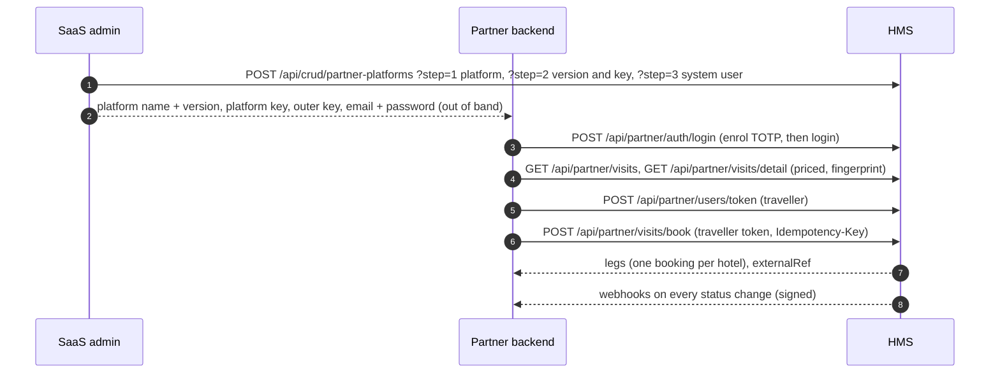

# Visits & Partner Platforms — Overview

A **visit** is a bundle of packages and services from **different hotels** (for example three nights at a Makkah package, two nights at a Madinah package, and a transfer), sold to **partner platforms** — third-party travel apps that list visits and book them for their own users.

When a partner books a visit, HMS creates one ordinary booking per component (a **leg**) at that component's hotel, all inside one database transaction: every leg is created or none is. Each hotel then operates its leg like any other booking.

| Page | Audience | Contents |
|---|---|---|
| [Visits admin APIs](./visits-admin-apis.md) | General Tenant Manager or visits curator (visits); SaaS admin (partners, outbox) | Visits CRUD, component picker, partner onboarding, event outbox |
| [Partner integration guide](./partner-integration-guide.md) | Partner engineering teams (hand this over) | Credentials, transport, auth, every endpoint with requests, responses and errors, events, sequence diagrams |

---

## Concepts

| Term | Meaning |
|---|---|
| Visit | A `visits` row (code, name, visibility) plus its ordered components in `visit_items`. Its availability window and length are configs (`publish_start_datetime`, `publish_end_datetime`, server-computed `duration`) |
| Leg | One booking created for one component. It carries `visit_id`, the partner's `externalRef` in `booking_metadata`, and `channel_platform_id` |
| Purchase | All legs of one partner order: the same `visit_id` and `externalRef` on the same platform |
| Sell price | The visit's own `catalog_pricing` row (`base_table = 'visits'`) |
| Allocation | `componentSum − sellPrice` is spread pro-rata across legs; the last leg absorbs rounding, so the leg totals add up to the sell price exactly |
| Channel | Every new booking (guest, admin or partner) records the platform it was made through in `bookings.channel_platform_id` |
| Consent | A hotel's components can be bundled only while its `allow_visit_bundling` tenant config is on |

## Personas

| Persona | Designation · role | Permission group | Seat |
|---|---|---|---|
| Visits curator | `VISITS` · Manager | `PG-VISITS` | System tenant, never cloned into hotels. Optional, assigned by hand to a dedicated visits operator |
| Partner system user | `PARTNER` · System | `PG-PARTNER-SYSTEM` | Tenant NULL; one per partner platform |
| Partner guest (traveller) | `PARTNER` · Guest | `PG-PARTNER-GUEST` | One global URDD (tenant NULL, `tenantUrddMap.global`, the actor the partner sends) plus one URDD per hotel that holds the legs, created on demand |

The visits CRUD permissions are also held by the general Tenant Manager (`PG-TENANT-MGMT`), who manages visits on the same URDD it manages all hotels with. The same migration also takes services and packages away from the general Tenant Manager: every operation on services, packages, package services, package pricing, service pricing, service locations and service location attributes is removed from `PG-TENANT-MGMT` and its seats. The general Tenant Manager picks components for a visit through the visits component picker, which needs only `list_visits`. Each hotel's own Tenant Manager, Tenant Admin and Service Manager keep managing their services and packages.

The SaaS admin does **not** manage visits, services or packages: migration `20261006_1_partner_platforms_group_saas_admin` removes every operation on them (list, view, add, update, delete, export, import, filter, search, sort) from `PG-FRAMEWORK` and from the SaaS admin seat. It keeps partner onboarding through the **`PG-PARTNER-PLATFORMS`** group (`list_partner_platforms`, `add_partner_platforms`, `update_partner_platforms`), linked to the SaaS admin RDD, and the event outbox permissions (`list_platform_events`, `update_platform_events`) through `PG-FRAMEWORK`.

A traveller created by a partner also gets the standard global guest URDD. **On a partner platform only partner-guest URDDs are accepted**, and every partner read and write is limited to bookings whose channel is the calling platform.

## After booking

| Who | What they can do with a visit leg |
|---|---|
| Partner platform | View the purchase, settle a balance, and cancel the **whole visit** (`externalRef`). Every leg still pending or confirmed is cancelled; legs already checked in, checked out or cancelled are reported and left. Schedule or reschedule the services inside a leg (spa, gym, dining, transport) through `GET /api/partner/visits/legs/slots` and `POST /api/partner/visits/legs/schedule`. No change to a leg's dates, party or price, no extension, add-on or single-leg cancel |
| Traveller in our guest app | Two roles. The normal guest role (`tenantUrddMap`) never shows visit legs. The partner guest role (`partnerTenantUrddMap`, one URDD per hotel plus `global`) shows that hotel's legs, or every hotel's with `global`: list, view and folio. It can also schedule or reschedule services inside a leg that is pending, confirmed or checked in (same transfer rule as the partner; the partner gets `leg.scheduled`), favourite, review after a checked-out stay, raise support tickets and edit the profile except the email. Booking, add or remove services, edit, extend, stage, cancel, check-in, check-out, payments, QR and loyalty redeem return `403 partner_guest_read_only`; check-in eligibility is blocked |
| Hotel staff (bookings CRUD, grouped bookings, booking-rooms edit) | Status only: pending → confirmed or cancelled (a rejection, which cancels the other legs of the purchase), confirmed → checked_in or no_show, checked_in → checked_out. Dates, party, amounts, package, guest and currency are locked (`409 visit_leg_locked`), other status moves return `409 visit_leg_status`, and a delete returns `409 visit_leg_locked` |
| Curator or general Tenant Manager | The visit itself (catalogue); a booked purchase is not changed |

## End-to-end flow



## Transport (every partner call)

Partners use the same two-layer envelope as our apps, with their **own platform name, version and key**:

```text
innerKey        = (accessToken, when authenticated) + platformKey
reqData         = AES(payload, innerKey)
encryptedRequest = AES({ reqData, encryptionDetails: { PlatformName, PlatformVersion, accessToken } }, outerKey)
```

`POST`/`PUT` send `{ "encryptedRequest": "…" }` as the body, `GET` sends the `encryptedrequest` header. Authenticated calls also send the `accesstoken` header. Responses are encrypted with the same inner key; a renewed token arrives in the `x-new-accesstoken` header and must replace the stored one.

Every request needs the device headers `x-client-platform: web`, `x-client-device-uuid` and `x-app-version`.

Partner endpoints refuse any platform that is not an active partner (`403 not_a_partner_platform`), enforce the platform's optional egress-IP allowlist (`403 ip_not_allowed`) and its per-minute rate limit (`429 rate_limited`).

## Errors

Visit and partner errors carry their reason as the SCC (`meta.scc`, also `error.details.code`) beside the HTTP status:

| Status | Codes |
|---|---|
| 400 | `credentials_required`, `otp_required`, `invalid_otp_flow`, `idempotency_key_required`, `visit_id_required`, `target_required`, `booking_id_required` |
| 401 | `invalid_credentials`, `invalid_otp` |
| 403 | `not_a_partner_platform`, `ip_not_allowed`, `wrong_token`, `persona_mismatch`, `totp_revoked` |
| 404 | `visit_not_found`, `booking_not_found`, `nothing_to_cancel`, `platform_not_found`, `event_not_found` |
| 409 | `price_changed`, `leg_unavailable`, `leg_failed`, `external_ref_reused`, `idempotency_key_reused`, `totp_confirm_required`, `otp_flow_mismatch`, `visit_unavailable`, `visit_not_priced`, `overpayment` |
| 422 | `invalid_party`, `invalid_start_date`, `external_ref_required`, `fingerprint_required`, `outside_sellable_window`, `invalid_items`, `invalid_price` |
| 423 | `locked` |
| 429 | `rate_limited` |
